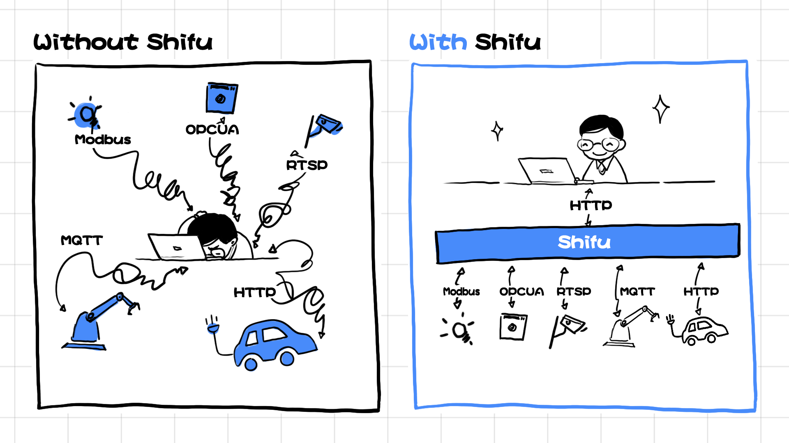

中文 | [English](README.md)

</img>

<h1 style="border-bottom: none">
 
    Kubernetes原生的物联网开发平台
     
</h1>
Shifu是一个K8s原生的、生产级、支持多协议设备接入、开放的物联网开发平台。

  

    
    &nbsp;
    
    &nbsp;
    
     &nbsp;
    

## 特点

* **Kubernetes原生** — 应用开发的同时进行设备管理，无需再构建额外的运维基础设施。

* **开放平台** — 避免供应商锁定，你可以轻松地将Shifu部署在公有云、私有云或混合云上。Shifu将Kubernetes带入到物联网边缘计算场景中，助力实现物联网应用程序的可扩展性和高可用性。

* **多协议设备接入** — HTTP、MQTT、RTSP、Siemens S7、TCP Socket、OPC UA...从公有协议到私有协议，Shifu的微服务架构让我们能够快速整合接入新的协议。

</img>

## 如何用五行代码连接一个使用私有协议的摄像头

</img>

</img>

## 社区

欢迎加入Shifu社区，分享您的思考与想法，

您的意见对我们来说无比宝贵。 我们无比欢迎您的到来！

## 开始上手

欢迎参考🗒️[Shifu技术文档](https://shifu.run/)获取更详细的信息:
- 🔧[安装Shifu](https://shifu.run/zh-Hans/docs/guides/install/install-shifu-dev)
- 🔌[设备连接](https://shifu.run/zh-Hans/docs/guides/cases/)
- 👨‍💻[应用开发](https://shifu.run/zh-Hans/docs/guides/application/)

## 贡献 

欢迎向我们[提交issue](https://github.com/Edgenesis/shifu/issues/new/choose) 或者[提交PR](https://github.com/Edgenesis/shifu/pulls)!

我们对[贡献者们](https://github.com/Edgenesis/shifu/graphs/contributors)心怀感激🥰.

## Github Star数量

## 许可证

该项目使用Apache2.0许可证。

