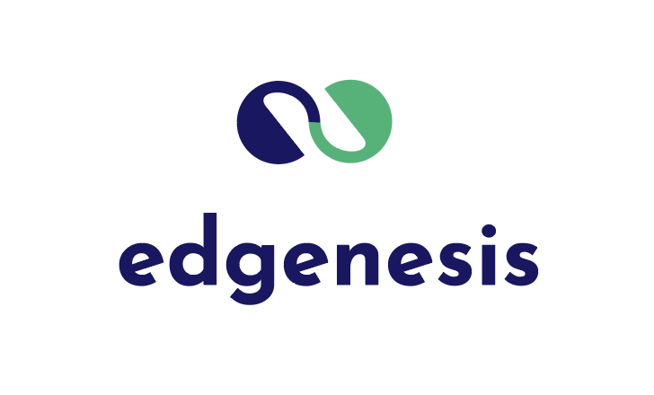

## [English](README.md)

- [Shifu](#shifu)
  - [什么是 Shifu?](#什么是-shifu)
  - [为什么用 Shifu?](#为什么用-shifu)
  - [如何使用 Shifu?](#如何使用-shifu)
  - [带演示的快速上手指南](#带演示的快速上手指南)
- [我们的路线图](#我们的路线图)
  - [Shifu OS 的当前状况](#shifu-os-的当前状况)
  - [协议](#协议)
    - [已支持](#已支持)
  - [功能](#功能)
    - [已支持](#已支持-1)
    - [还未支持](#还未支持)
  - [里程碑](#里程碑)
- [Shifu的愿景](#shifu的愿景)
  - [让开发者和运维人员再次开心](#让开发者和运维人员再次开心)
  - [软件定义世界 (SDW)](#软件定义世界-sdw)
- [社区](#社区)
  - [联系](#联系)

# Shifu

## 什么是 Shifu?

Shifu是一个k8s原生的IoT设备虚拟化框架。 Shifu希望帮助IoT开发者以即插即用的方式实现IoT设备的监视、管控和自动化。

## 为什么用 Shifu?

Shifu让管理和控制IoT设备变得极其简单。当你连接设备的时候，Shifu会识别并以一个k8s pod的方式启动一个该设备的虚拟设备 ***deviceShifu***。 ***deviceShifu*** 提供给用户了高层的交互抽象。开发者通过实现 ***deviceShifu*** 的接口，不仅可以实现IoT设备的所有设计功能，还可以实现原本设备所不具备的功能！例如：在设备允许的状况下，通过一行命令来回滚设备的状态。Shifu 还可以实现横向（设备分组）以及纵向（设备分层，来自动执行更高级的命令比如`工厂开`。Shifu 也会将您整个 IoT 系统安全升级。之后实现的 simulation 功能可以使开发人员在执行命令前演算一遍。

## 如何使用 Shifu?

当前，Shifu运行在[Kubernetes](k8s.io) 上。我们将来会提供包含单独部署在内的更多部署方式。

## 带演示的快速上手指南

我们为开发者准备了一个 [Demo](docs/guide/quick-start-demo-zh.md) 来更直观地展示 `Shifu`是如何建立管理IoT设备的。

# 我们的路线图

## Shifu OS 的当前状况
We will continuously add in features as we develop Shifu OS
我们将会在开发 Shifu OS 的过程中不断完善加入新的功能
## 协议
### 已支持
- HTTP
- 通过命令行的驱动
- ... 更多正在开发中
## 功能
### 已支持
- 指标收集
- 代理命令到设备
- 和 Kubernetes 通过 CRD 整合
- 初级的 Shifu 控制器
### 还未支持
- 声明式 API
- 高级的 Shifu 控制器
- shifud
- 抽象
  - 横向
  - 纵向
- 演算
- 安全功能
  - 防火墙
  - uTLS

## 里程碑

<table class="tg">
<thead>
  <tr>
    <th class="tg-0pky">By</th>
    <th class="tg-0pky">Protocol</th>
    <th class="tg-0pky">Features</th>
  </tr>
</thead>
<tbody>
  <tr>
    <td class="tg-0pky">Q4 2021</td>
    <td class="tg-0pky">HTTP Driver w/ command line </td>
    <td class="tg-0pky">Telemetry Command proxy CRD integration Basic Controller</td>
  </tr>
  <tr>
    <td class="tg-0pky">Q1 2022</td>
    <td class="tg-0pky">至少: MQTT Modbus ONVIF 国标GB28181 USB</td>
    <td class="tg-0pky">Declarative API Advanced Controller shifud</td>
  </tr>
  <tr>
    <td class="tg-0pky">Q2 2022</td>
    <td class="tg-0pky">至少: OPC UA Serial Zigbee LoRa PROFINET</td>
    <td class="tg-0pky">Abstraction</td>
  </tr>
  <tr>
    <td class="tg-0pky">Q3 2022</td>
    <td class="tg-0pky">TBD</td>
    <td class="tg-0pky">Security Features</td>
  </tr>
  <tr>
    <td class="tg-0pky">Q3 2023</td>
    <td class="tg-0pky">TBD</td>
    <td class="tg-0pky">Simulation</td>
  </tr>
</tbody>
</table>

# Shifu的愿景

## 让开发者和运维人员再次开心

开发者和维护人员应将100%聚焦在发明创造上，而不是修补基础设施以及重复造轮子。身为开发者和运维人员本身，Shifu的作者们深刻理解你的痛点！所以我们发自内心地想帮你解决掉底层的问题，让开发者和运维人员再次开心！

## 软件定义世界 (SDW)

如果每一个IoT设备都有一个Shifu，我们就可以借助软件来管理我们周围的世界。在一个软件定义的世界中，所有东西都是智能的。你周围的一切会自动改变，进而更好的服务你。因为归根到底，科技以人为本。

# 社区
## 联系
有问题？尝试[建立一个 GitHub Issue](https://github.com/Edgenesis/shifu/issues/new)，或者通过以下方式联系我们：
- 发送邮件到 info@edgenesis.com 
