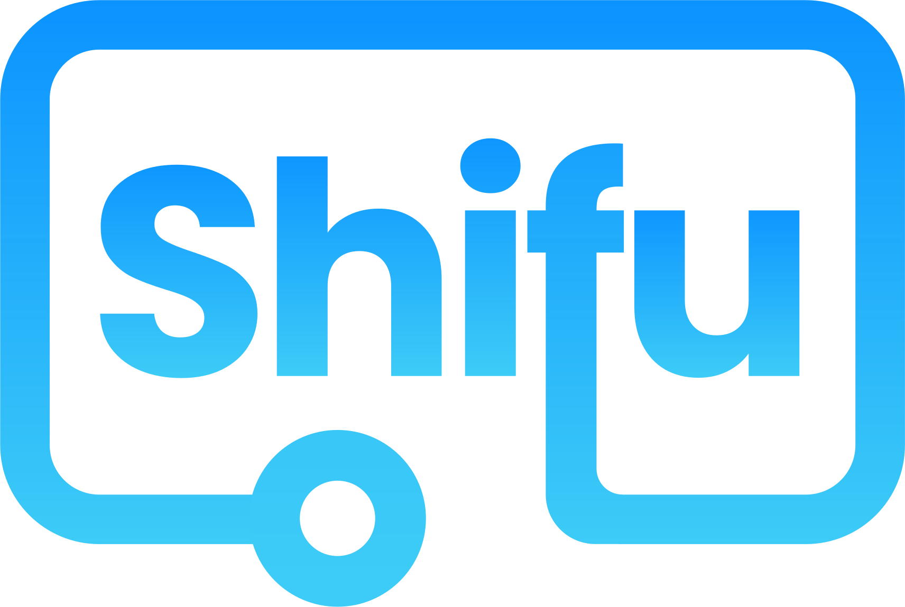
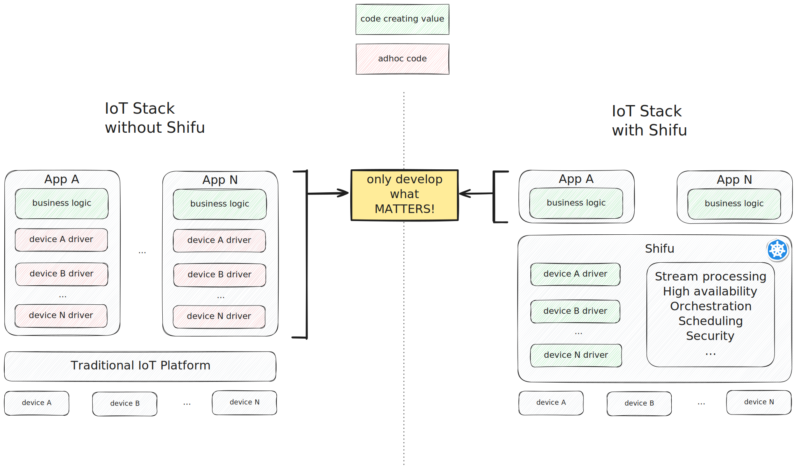
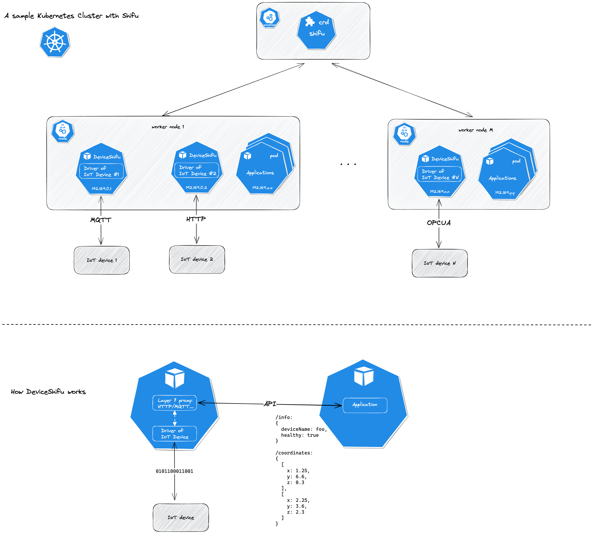
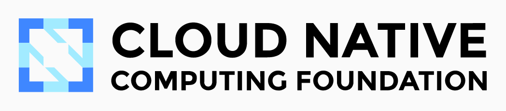
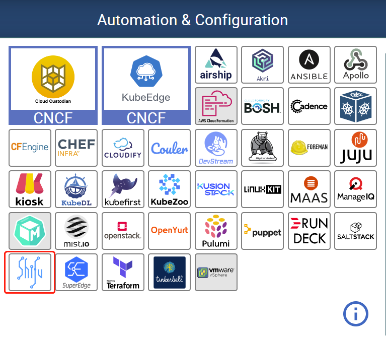

中文 | [English](README.md) | [日本語](README-ja.md)

</img>

<h1 style="border-bottom: none">
 
    Kubernetes原生的物联网网关
     
</h1>
Shifu是一个k8s原生的，生产级的，支持多协议设备接入的开放物联网网关。

  

    
    &nbsp;
    
    &nbsp;
    
    &nbsp;
    
    &nbsp;
    

## ✨招聘✨
我们正在招聘！Shifu大家庭举双手欢迎爱折腾的你！！！

[👉🙋‍♀️**职位点这里**👈🙋‍♂️](https://4g1tj81q9o.jobs.fbmms.cn/page/PSVAGacDW6xEEcT5qbbfRL0FR3)

## Shifu的价值: 让大家开发应用，而不是基础设施

</img>

## CNCF现场直播和演示

## 特点
**Kubernetes原生** — 应用开发的同时进行设备管理，无需再构建额外的运维基础设施

**开放平台**— 避免供应商锁定，你可以轻松地将Shifu部署在公有云、私有云或混合云上。Shifu将Kubernetes带入到物联网边缘计算场景中，助力实现物联网应用程序的可扩展性和高可用性。

**多协议设备接入** — HTTP, MQTT, RTSP, Siemens S7, TCP socket, OPC UA...从公有协议到私有协议，Shifu的微服务架构让我们能够快速整合接入新的协议。

## 定义 
**shifu** - 一个把IoT设备接入Kubernetes集群的CRD。

**DeviceShifu** - 一个Kubernetes pod，同时也是Shifu的最小单元。DeviceShifu的主要组成部分是设备的驱动，代表一个IoT设备，也可以称之为“数字孪生”。

</img>

## 如何用五行代码连接一个使用私有协议的摄像头

</img>

</img>

## 社区

欢迎加入Shifu社区，分享您的思考与想法，

您的意见对我们来说无比宝贵。 我们无比欢迎您的到来！

## 开始上手
欢迎参考🗒️[Shifu技术文档](https://shifu.dev/)获取更详细的信息:
- 🔧[安装Shifu](https://shifu.dev/zh-Hans/docs/guides/install/install-shifu-dev)
- 🔌[设备连接](https://shifu.dev/zh-Hans/docs/guides/cases/)
- 👨‍💻[应用开发](https://shifu.dev/zh-Hans/docs/guides/application/)
- 🎮[KillerCoda Demo在线试玩](https://killercoda.com/shifu/shifu-demo)

## 贡献 
欢迎向我们[提交issue](https://github.com/Edgenesis/shifu/issues/new/choose) 或者[提交PR](https://github.com/Edgenesis/shifu/pulls)!

我们对[贡献者们](https://github.com/Edgenesis/shifu/graphs/contributors)心怀感激🥰.

## Shifu正式加入[CNCF全景图](https://landscape.cncf.io/)

</img>

</img>

## Github Star数量

## 许可证
该项目使用Apache2.0许可证。
