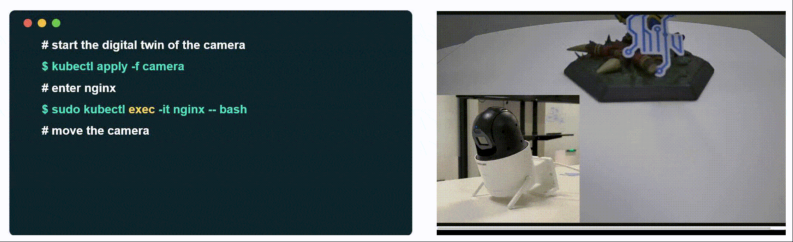
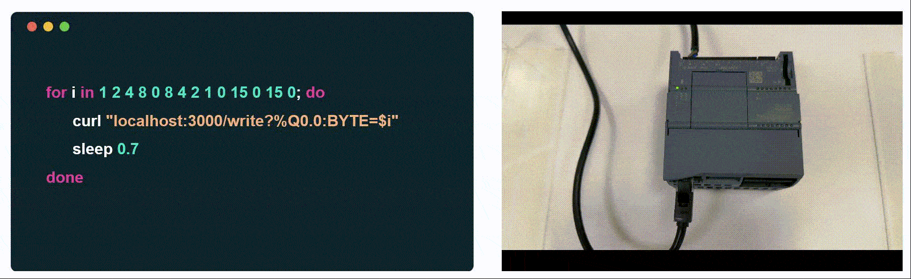

<div align="right">

中文 | [English](README.md)

[](http://makeapullrequest.com)
[](https://goreportcard.com/report/github.com/Edgenesis/shifu)
[](https://codecov.io/gh/Edgenesis/shifu)
[](https://dev.azure.com/Edgenesis/shifu/_build/latest?definitionId=19&branchName=main)
[](https://github.com/Edgenesis/shifu/actions/workflows/golangci-lint.yml)

</div>

<div align="center">

</img>

Shifu是一个Kubernetes原生的物联网开发框架，大大提高了物联网开发的效率、质量及可复用性。
</div>

|特点|  |
|---|---|
|🔌极速设备接入 &nbsp;&nbsp;&nbsp;&nbsp;&nbsp;&nbsp;&nbsp;&nbsp;|可兼容各类协议及设备|
|👨‍💻高效应用开发|Shifu将每一个设备进行结构化虚拟，并将其能力以API的形式开放出来|
|🔧超低运维成本|Shifu使用Kubernetes原生框架，您无需再构建额外的运维基础设施|

# 🪄Demo
</img>
</img>

# 🔧安装

- 如果你有Kubernetes集群，使用`kubectl apply` 命令将Shifu安装到您的集群上：

    ```sh
    cd shifu
    kubectl apply -f pkg/k8s/crd/install/shifu_install.yml
    ```

- 如果您没有Kubernetes集群也完全没有关系，您可以下载我们的demo来进行试玩
  - Download Docker
  
    [Mac](https://docs.docker.com/desktop/install/mac-install/) | [Windows(WSL)](https://docs.docker.com/desktop/install/windows-install/) | [Linux](https://docs.docker.com/desktop/install/linux-install/)
  - Download Shifu Demo with a single command
    ```sh
    curl -sfL https://raw.githubusercontent.com/Edgenesis/shifu/main/test/scripts/shifu-demo-install.sh | sudo sh -
    ```

- 现在您已经成功安装了Shifu，请参照我们的🗒️[文档](https://shifu.run/zh-Hans/docs/) 来尝试🔌[接入设备](https://shifu.run/zh-Hans/docs/guides/cases/) 以及 👨‍💻[应用开发](https://shifu.run/zh-Hans/docs/guides/application/)吧!

# 💖加入社区

欢迎加入Shifu社区，分享您的思考与想法，您的意见对我们来说无比宝贵。
我们无比欢迎您的到来！

[Discord](https://discord.com/channels/1024601454306136074/1039472165399052339) | [Github discussion](https://github.com/Edgenesis/shifu/discussions) | [Twitter](https://twitter.com/ShifuFramework)

# ✍️贡献
欢迎向我们[提交issue](https://github.com/Edgenesis/shifu/issues/new/choose)或者 [提交pull request](https://github.com/Edgenesis/shifu/pulls)!

我们对[贡献者](https://github.com/Edgenesis/shifu/graphs/contributors)满怀感激🥰。

# 🗒️证书
This project is Apache License 2.0.

# 🌟GitHub Star 数量
[](https://starchart.cc/Edgenesis/shifu)