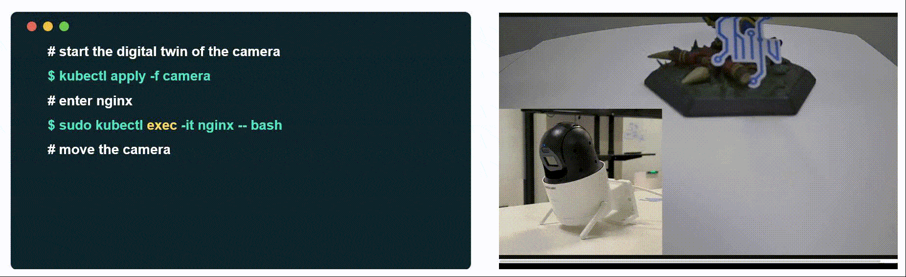
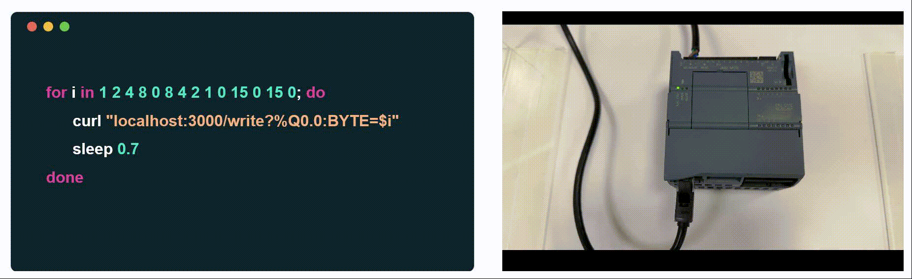

<div align="right">

[中文](README-zh.md) | English

[](http://makeapullrequest.com)
[](https://goreportcard.com/report/github.com/Edgenesis/shifu)
[](https://codecov.io/gh/Edgenesis/shifu)
[](https://dev.azure.com/Edgenesis/shifu/_build/latest?definitionId=19&branchName=main)
[](https://github.com/Edgenesis/shifu/actions/workflows/golangci-lint.yml)

</div>

<div align="center">

</img>


Shifu is a Kubernetes-native IoT development framework that greatly improves the efficiency, quality and reusability of IoT application development.
</div>

|Feature|  |
|---|---|
|🔌Fast Device integration &nbsp;&nbsp;&nbsp;&nbsp;&nbsp;&nbsp;&nbsp;&nbsp;|Compatible with almost all protocols and drivers.|
|👨‍💻Efficient Application development|Shifu structually virtualizes each device and expose its capabilities in the form of APIs.|
|🔧Easy Operation & Maintenance|Kubernetes-native framework, sparing the need for maintaining an additional O&M infrastructure.|

# 🪄Demo
</img>
</img>

# 🔧Install

- If you have started a Kubernetes cluster, use the command `kubectl apply` to install Shifu in your cluster:

    ```sh
    cd shifu
    kubectl apply -f pkg/k8s/crd/install/shifu_install.yml
    ```

- If you don't have a Kubernetes cluster on your computer, that's totally ok, you can download our demo to try it out.
  - Download Docker
  
    [Mac](https://docs.docker.com/desktop/install/mac-install/) | [Windows(WSL)](https://docs.docker.com/desktop/install/windows-install/) | [Linux](https://docs.docker.com/desktop/install/linux-install/)
  - Download Shifu Demo with a single command
    ```sh
    curl -sfL https://raw.githubusercontent.com/Edgenesis/shifu/main/test/scripts/shifu-demo-install.sh | sudo sh -
    ```

- Now that you have installed Shifu, please visit our🗒️[documentation](https://shifu.run/docs/) to🔌[connect a device](https://shifu.run/docs/guides/cases/) and 👨‍💻[develop your own application](https://shifu.run/docs/guides/application/)!

# 💖Community

Welcome to the Shifu community to share your thoughts and ideas! Any suggestion will be deeply valued.
We couldn't be more excited to have you.

[Discord](https://discord.com/channels/1024601454306136074/1039472165399052339) | [Github discussion](https://github.com/Edgenesis/shifu/discussions) | [Twitter](https://twitter.com/ShifuFramework)

# ✍️Contributing
Feel free to [create an issue](https://github.com/Edgenesis/shifu/issues/new/choose) or [submit a pull request](https://github.com/Edgenesis/shifu/pulls)!

We will forever be beholden to all the [contributors](https://github.com/Edgenesis/shifu/graphs/contributors)🥰.

# 🗒️License
This project is Apache License 2.0.

# 🌟Stargazers over time

[](https://starchart.cc/Edgenesis/shifu)