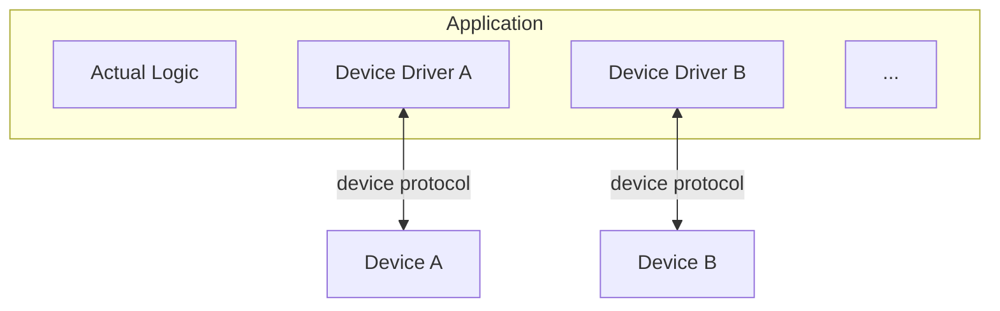
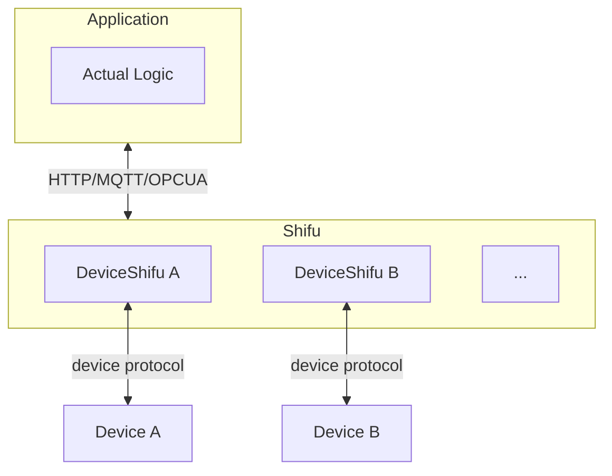
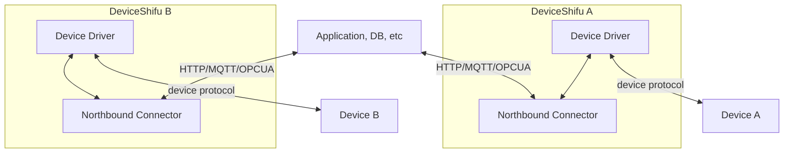

# Answers from Edgenesis

## Q1: How do you integrate a non-discoverable device into your solution?

### Imagine you want to support a new device and you have access to one version of it. You find the documentation online and want to write a reusable integration for it

### Q1 Answer

This is done by writing a YAML file to describe the device and its capabilities. We'd like to switch our definition to TD defined in WoT.

Currently, If the device supports public protocols, we can support it seamlessly with our framework.
We currently support: **MQTT, OPCUA, HTTP, Socket, TCP, Modbus, Simens s7, PLC4X** *(PLC4X DeviceShifu is deprecated as of v0.81.0 and scheduled for removal in a future release; see https://github.com/Edgenesis/shifu/issues/1271 for details.)*
If the device only supports proprietary protocols, we would create a reusable driver for the device to abstract its capabilities and package it into a docker container, and then make the container a completely reusable digital twin called *deviceShifu*. Whenever you have a new project, you can just mix&match *deviceShifu* and configure it with the necessary parameters, just like how you play with lego blocks.

An example for this scenario can be found [here](https://github.com/Edgenesis/shifu/tree/main/examples/rtspDeviceShifu):
We first created a driver called [camera.py](https://github.com/Edgenesis/shifu/blob/main/examples/rtspDeviceShifu/camera.py) which is a python webserver that works as the driver for the camera. We than build it into a docker image and put it as sidecar with our *deviceshifuHTTP* andd added necessary configs into our deployment.yaml like:

```yaml
- image: edgehub/camera-python:v0.0.1
        name: camera-python
        ports:
        - containerPort: 11112
        volumeMounts:
        - name: deviceshifu-config
          mountPath: "/etc/edgedevice/config"
          readOnly: true
        env:
        - name: EDGEDEVICE_NAME
          value: "edgedevice-camera"
        - name: EDGEDEVICE_NAMESPACE
          value: "devices"
        - name: IP_CAMERA_ADDRESS
          value: "192.168.14.254"
        - name: IP_CAMERA_HTTP_PORT
          value: ""
        - name: IP_CAMERA_RTSP_PORT
          value: ""
        - name: IP_CAMERA_USERNAME
          value: "admin"
        - name: IP_CAMERA_PASSWORD
``` 

so that users can use this integration with proprietary protocol as with standard `deviceshifuHttp`. Also, the driver can be reused for different projects with different configurations. We also have a GPT-Powered AI assistant called IOT Driver Copilot to help us create the driver, which can make our life easier. **We think IOT Driver Copilot can be a great starting point to auto-genaerate reusable WOT-compliant device drivers.**

## Q2. Does this integration only require parameters or also code to be executed?

### In some cases, the declaration of protocol parameters are not sufficient to retrieve values, e.g. when the device needs to be configured beforehand or when values from the device need to be normalized to a range (e.g. voltage to degree Celsius). How do you handle such situations?

### Q2 Answer

Our framework by default will retrieve raw data from the device.
Depending on the application use case, user may need to write a driver and can use the help of IOT Driver Copilot to generate the driver and package it into a container.
For the case that values from the device need to be processed/normalized, we have integrated a FaaS(function as a service) like service to let users handle the raw data the way they like, called customizedDeviceShifu. Users can write custom code to deal with the raw data and transform it to whatever data format they need. We have a detailed example [here](https://github.com/Edgenesis/shifu/tree/main/examples/deviceshifu/customized/humidity_detector):
In the configmap, user can add a field called *customInstructionsPython* to specify the function defined in python to transform data.

```yaml
customInstructionsPython: |
    humidity_custom: humidity_raw_data
```

The corresponding *[deviceshifu](https://github.com/Edgenesis/shifu/blob/main/pkg/deviceshifu/deviceshifuhttp/deviceshifuhttp.go#L224-L251)* will utilize this function to transform the raw data before returning it to the user.

## Q3. How do you test and debug the integration?

### Do you employ a test suite that checks all the interactions defined in your integration. What if a configuration doesn't work? How do you debug the communication?

### Q3 Answer

1. We do have a end to end test suites for all the existing interactions defined in our integrations. We also have a set of physical devices for testing if necessary. The setup of our e2e tests can be found [here](https://github.com/Edgenesis/shifu/blob/main/azure-pipelines/azure-pipelines.yml).
2. Before packaging the device driver into a *deviceShifu*, users would be responsible for making sure the device driver is working properly as they are the device owners. We are responsible for the general framework's correctness.

## Q4.  How do you make the integration reusable in other installations?

### An integration might be done on a project base. How do you make this integration reusable? Do you maintain a catalog of device integrations?

### Q4 Answer

This is the biggest strength of our offerings. Without our solution, applications are tightly coupled with devices, because they built device drivers into their applications. With our solution, we can abstract the device drivers into reusable components called *deviceShifu* and package them into docker containers. We then deploy the containers into kubernetes cluster and expose them as kubernetes services. Applications can then use the *deviceShifu* as a service and interact with the devices via the *deviceShifu*. The following diagrams show the difference between the two approaches:

#### Without our solution



#### With our solution *Shifu*



Where *Shifu* is a logical grouping of *DeviceShifu*, which can be treated as reusable lego blocks.

#### Here's a more detailed diagram of how we do the integration



We do have a catalog or library of drivers we have done so far so we can reuse it for different scenarios.

Also our framework is protocol based and vendor agnostic, so it can guarantee reusability in its best efforts. It can be observed from our CRD definition:

```go
type ProtocolSettings struct {
	MQTTSetting   *MQTTSetting   `json:"MQTTSetting,omitempty"`
	OPCUASetting  *OPCUASetting  `json:"OPCUASetting,omitempty"`
	SocketSetting *SocketSetting `json:"SocketSetting,omitempty"`
	TCPSetting    *TCPSetting    `json:"TCPSetting,omitempty"`
}

// EdgeDeviceSpec defines the desired state of EdgeDevice
type EdgeDeviceSpec struct {
	// INSERT ADDITIONAL SPEC FIELDS - desired state of EdgeDevice
	// Important: Run "make" to regenerate code after modifying this file

	// Sku specifies the EdgeDevice's SKU.
	Sku              *string            `json:"sku,omitempty"`
	Connection       *Connection        `json:"connection,omitempty"`
	Address          *string            `json:"address,omitempty"`
	Protocol         *Protocol          `json:"protocol,omitempty"`
	ProtocolSettings *ProtocolSettings  `json:"protocolSettings,omitempty"`
	CustomMetadata   *map[string]string `json:"customMetadata,omitempty"`

	// TODO: add other fields like disconnectTimemoutInSeconds
}
```

Each *EdegeDevice* 's spec only contains settings for protocol, we then choose which protocol specific binary to run on our kubernetes deployment:

```yaml
template:
    metadata:
      labels:
        app: deviceshifu-mqtt-deployment
    spec:
      containers:
      - image: edgehub/deviceshifu-http-mqtt:nightly
        name: deviceshifu-http
        ports:
        - containerPort: 8080
```

The above example is how we run devices using *MQTT* protocol. The instructions for different use cases are dynamically configurable via configmaps, so for different scenarios, users can just put different instructions in the configmap.

```yaml
# Example on how to configure OPCUA instructions in the configmap
instructions: |
    instructions:
      get_value:
        protocolPropertyList:
          OPCUANodeID: "ns=2;i=2"
      get_time:
        protocolPropertyList:
          OPCUANodeID: "i=2258"
      get_server:
        protocolPropertyList:
          OPCUANodeID: "i=2261"
```

For mor details on protocol abstractions can be found [here](https://github.com/Edgenesis/shifu/tree/main/pkg/k8s/api/v1alpha1)

## Q5. Do you have an automatic validation for device integration contributions?

### The device is not necessarily available at the time the device integration is cataloged. How do you make sure it is valid?

### Q5 Answer

To make it clear, we provide the framework and tools for integration, but not the actual integration itself. Unless you hire us to implement the actual project. That's when we have access to the physical devices. Meanwhile, we also validate the integration by simulators and mocks if we don't have the physical device in our office. This [directory](https://github.com/Edgenesis/shifu/tree/main/pkg/deviceshifu/mockdevice) contains all the mocks we have done so far.
But we will try to test the integration against real device whenever we have the chance.

## Q6. How do you normalize devices of the same type to a unified interface?

### To write scalable applications, the diversity of devices of the same type need to be mapped to a normalized interface. For example, an application developer wants to always handle power consumption in kWh and use the same name for the datapoint in his/her code. Do you support this kind of normalization?

### Answer

To integrate devices of the same type, we have a feature called *swarm mode*. It is documented [here](https://github.com/Edgenesis/shifu/blob/ad82d809921b3e2cfd8a067d4f90a5996f49a79b/docs/design/design-shifu.md?plain=1#L135).

To alias the instructions so the applicatio developer can always handle power consumption in kWh and use the same name for the datapoint in his/her code, we have a feature called *instructionMap*. [Here's an example](https://github.com/Edgenesis/shifu/blob/ad82d809921b3e2cfd8a067d4f90a5996f49a79b/docs/design/design-shifud.md?plain=1#L87).

 
## Q7.  What are the three most important topics, you would like to see open source support for?

### Q7 Answer

1. List *Shifu* to be one of the preferred WoT-compliant application development and device integration frameworks.
2. Get some real world use cases ASAP.
3. Figure out how we can coordinate our efforts and come up with a blueprint/best practice for building scalable AIoT solutions.
