# Shifu White Paper

## 1. Shifu Introduction

Shifu is a Kubernetes native, production-grade, protocol & vendor agnostic IoT edge framework.

***Shifu*** has gained control over IoT devices and successfully endow such capabilities to developers in the form of APIs. In this way, traditional IoT application development is reduced to simple web development, which greatly improves the efficiency, quality and reusability of IoT application development.

[https://github.com/Edgenesis/shifu](https://github.com/Edgenesis/shifu)

    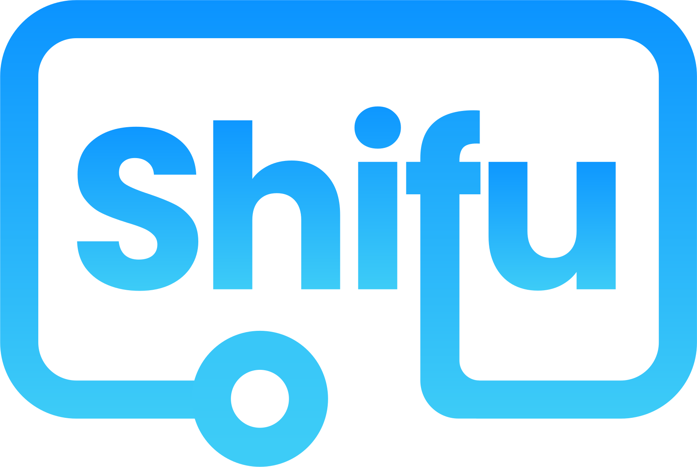

## 2. Highlights

### Cloud-native

As a cloud-native framework, Shifu extends the resources of [Kubernetes](https://kubernetes.io/) through its [CRD feature](https://kubernetes.io/docs/tasks/extend-kubernetes/custom-resources/custom-resource-definitions/) to achieve high availability, static domain names, service management, etc. Shifu can support any form of configuration for any device. When a physical device is connected, Shifu recognizes and starts the device's digital twin deviceShifu as a [Kubernetes Pod](https://kubernetes.io/docs/concepts/workloads/pods/).

### Digital Twins

Leveraging on digital twin technology, ***Shifu*** successfully empowers devices with a thinking "digital brain". The digital twin will reflect the real-time state of the device, and developing operations on it is equivalent to operating the device itself.

### Open Platform

No vendor lock-in. You can easily deploy Shifu on the edge(from RaspberryPi to edge clusters) or on the cloud(public, private and hybrid clouds are all supported).

### Protocol Agnostic

HTTP, MQTT, RTSP, Siemens S7, TCP socket, OPC UA etc. The microservice architecture of Shifu enables it to quickly adapt to new protocols.

## 3. Problems in the IIOT Industry

1. **Multiple Manufacturers**: The presence of multiple manufacturers in IoT development introduces significant complexity and interoperability challenges. Each manufacturer often uses distinct standards and proprietary designs, which require specialized integration efforts. This lack of standardization demands extra time and resources for developers to research, test, and create applications that can work seamlessly across a diverse device ecosystem.
2. **Different Programming Languages**: Different programming languages used across IoT devices increase the learning curve for developers, who need to be proficient in multiple languages to write and maintain efficient code. This variety also complicates debugging and expanding applications while requiring additional layers of tooling and frameworks for smooth integration.
3. **Various Protocols**: The use of various transport protocols increases network complexity and programming efforts. Developers must carefully implement different communication models, increasing the maintenance costs due to varying security requirements, message formats, and the need for extensive testing to ensure reliable data flow.

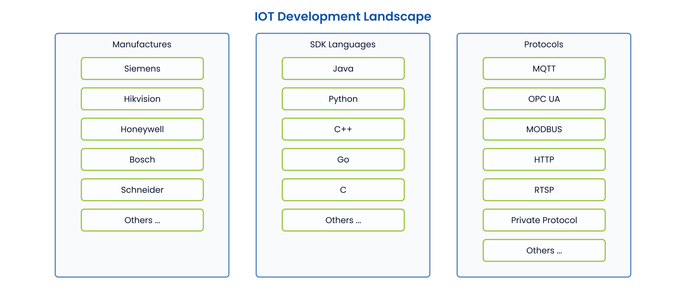

## 4. Our Solution

### Standardize Device into web API (deviceShifu)

Our solution simplifies these complexities by providing developers with a standardized web API. We achieve this by creating Docker images for device SDKs and deploying them as **deviceshifu** (aka. device digital twin) within a Kubernetes cluster.

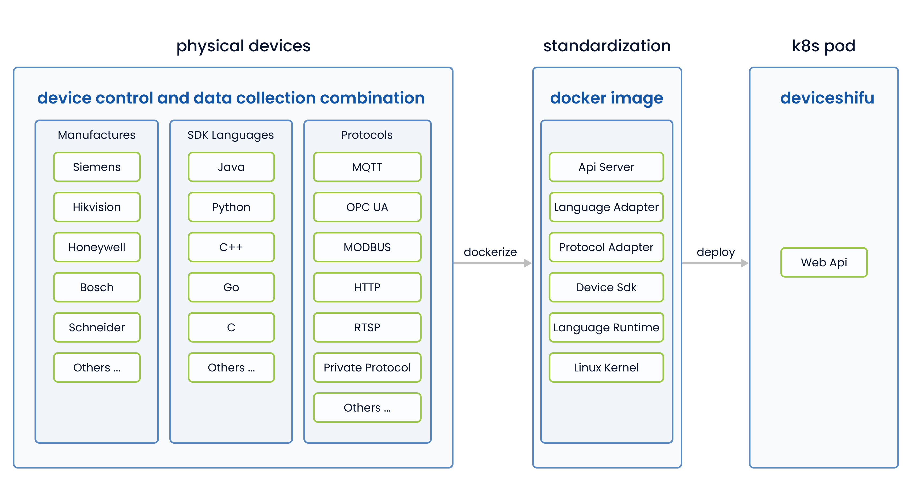

### Programming with Device Web API

Once we encapsulate device SDKs in Docker images and deploy them within a Kubernetes cluster, developing IoT applications becomes as straightforward as building a web app. This approach also leverages Kubernetes' cloud-native extensibility and inherent advantages in security and network management.

## 5. Use Case 1 - Industry 4.0 Lab

### Testimony

"Shifu helps us integrate all of our devices in a smart and efficient way. With Shifu, we can treat all of our devices as software objects and abstract away the physical devices. This makes it easier for us to manage and control our devices."  -- Life Foundary

### Result

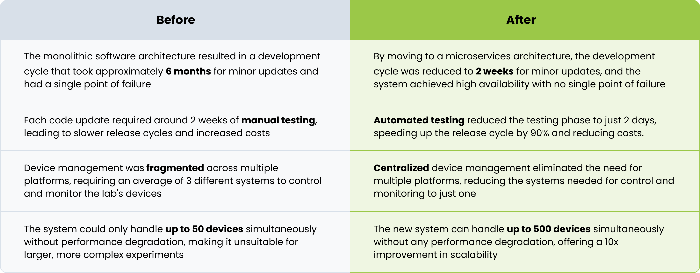

### Challenge

- The device drivers and applications were tightly integrated, making it difficult to update one without affecting the other. This results in a slow development process.
- With over 100 different types of devices from various vendors and using different protocols, standardizing communication and control became a herculean task.
- The existing monolithic architecture was not designed to scale, making it challenging to add new devices or expand the system to accommodate growing needs.

### Shifu Solution

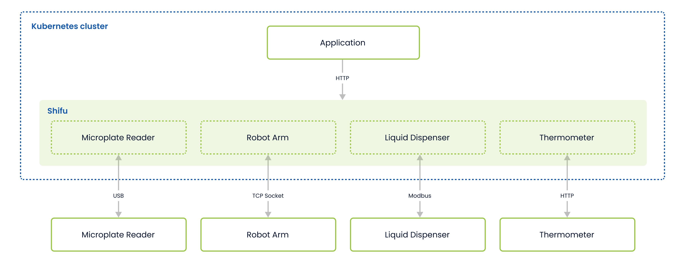

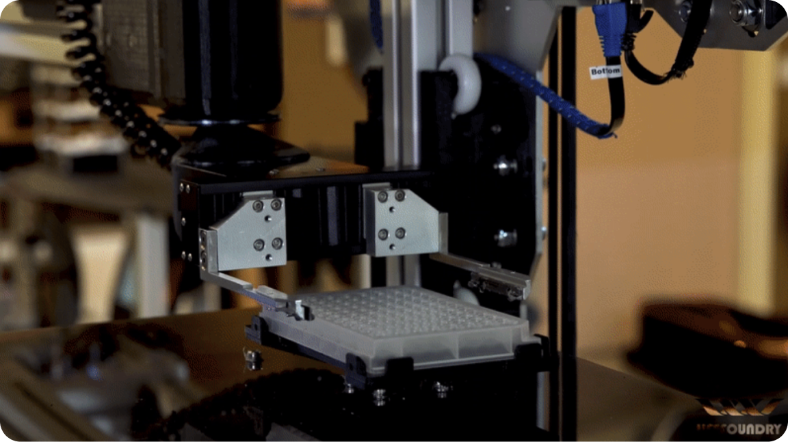

## 6. Use Case 2 - MR Edge AI Inspection

### Background

An energy company, due to the complex maintenance and operation of many critical devices, requires operators to use mixed-reality(MR) headset with AI assistance to ensure that each operation step is compliant and reliable.

### Result

### Challenges

- Slow integration of MR headsets. It takes months for engineers to familiarize themselves with a single MR headset. Different device vendors make this process even slower, for example, Microsoft's HoloLens, Apple's Vision Pro, and Meta's Quest Pro.
- Coupled AI model. The MR AI powered App is deeply coupled with AI models. Any changes from AI model require changes to the App.
- Not reusable. The MR headset integration for one app is not reusable for other apps since business logic is constantly changing.
- Not scalable. The trained AI models are combined with the app itself. It is not possible to scale them for usage in other instances

### Shifu Solution

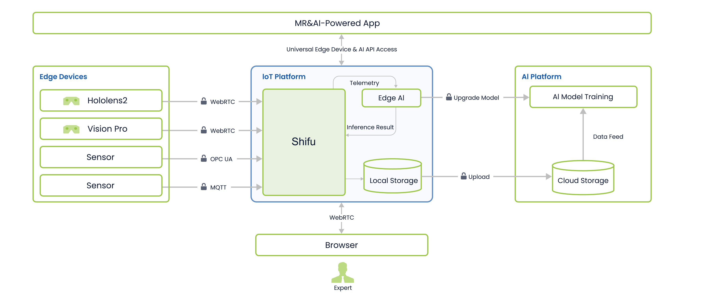

    
    

## 7. Use Case 3 -  Cloud Surveillance Security

### Background

A router manufacturer connects millions of cameras and recorders but lacks a unified monitoring solution and struggles with secure, cost-effective remote video access via mobile apps.

### Result

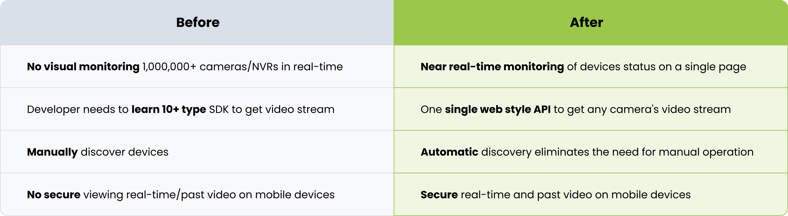

### Challenge

- 300k edge nodes are integrated with various camera and NVR manufacturers.
- Upgrade 300k edge nodes without downtime.
- High bandwidth is required to process video streams for 1 million cameras and 90k NVRs with <10ms latency.
- Secure video stream transport from edge to cloud, and then to the cell phone.

### Shifu Solution

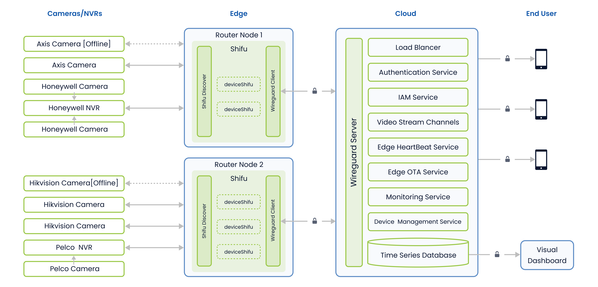

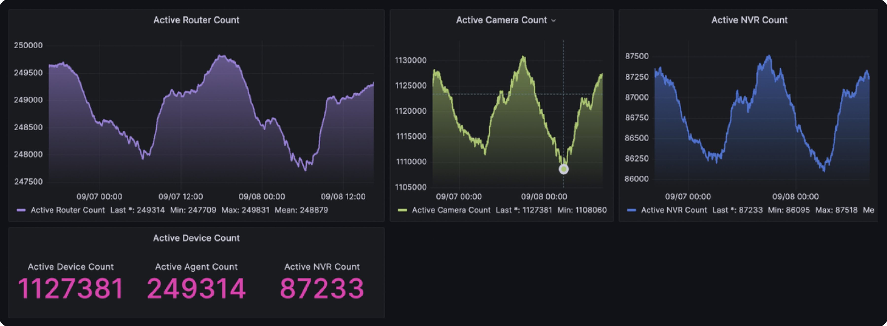

## 8. Use Case 4 - AgTech

### Background

The California Strawberry Commission is committed to digitalizing and enhancing field equipment, including tractors and other machinery, with the aim of achieving significant cost savings. These efforts support growers in California, who are responsible for 90% of strawberry production in the United States.

### Result

### Challenge

- Slow Device Integration, it takes months for a data scientist to integrate all the device with an edge computing unit
- The Arduino-based solution is not easy to scale when additional sensors or functionalities are required in the future.
- The connection and data push logic is unreliable from Arduino to the cloud. Data will very easily be permanently lost during this process.

### Shifu Solution

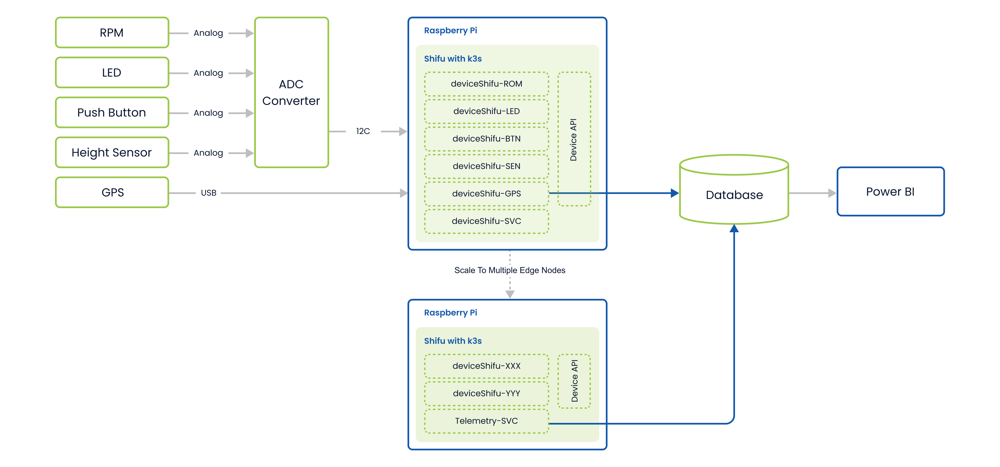

    
    

