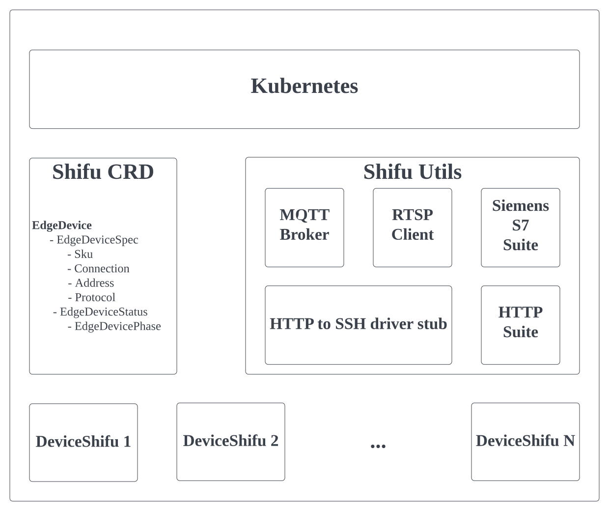

# Shifu 架构
Shifu是一个[Kubernetes](https://kubernetes.io/)原生的平台，它的所有组件都以[Pod](https://kubernetes.io/docs/concepts/workloads/pods/)的形式运行。下图是Shifu架构的概览：

## EdgeDevice
Shifu定义了一个[CRD](https://kubernetes.io/docs/tasks/extend-kubernetes/custom-resources/custom-resource-definitions/) `EdgeDevice`，它描述了一个连接到Shifu的实际设备的各项信息。

每一个EdgeDevice拥有两个部分：
`EdgeDeviceSpec` 和 `EdgeDeviceStatus`.

EdgeDeviceSpec包含了设备的基本信息。它拥有四个元素：

	Sku        *string     # 设备的SKU名称

	Connection *Connection # 硬件连接方式 (例：以太网, 4G等)

	Address    *string     # 硬件地址

	Protocol   *Protocol   # 传输协议

EdgeDevicePhase定义了设备的当前状态：
    Pending     # 设备已被识别，但接入Shifu尚未完成

    Running     # 设备已成功接入Shifu并正在运行

    Failed      # 设备接入Shifu失败

    Unknown     # 未知状态

## DeviceShifu
EdgeDevice定义了名为`DeviceShifu`的Kubernetes Pod. DeviceShifu是一个实际设备的数字化表示，或`数字孪生`。

每一个DeviceShifu都与一个实际设备相关联。用户与DeviceShifu进行交互，就可以实现与实际设备的交互。

**南向** - DeviceShifu接收用户的请求，对请求进行转换并发送到设备。
**北向** - DeviceShifu收集设备数据，进行转换并发送给用户端。

## Shifu Utils
Shifu在持续加入新的工具类服务来保证不同协议和驱动的兼容。

### MQTT Broker
MQTT Broker被用来帮助MQTT信息的订阅和发布。当前，Shifu使用了[Mosquitto](https://mosquitto.org/)来实现兼容。

### RTSP Client
RTSP Client保证了流媒体信息的传输。

### Siemens S7 Suite
Siemens S7 Suite支持了西门子S7系列PLC的操作。当前，Shifu使用了[Snap7](http://snap7.sourceforge.net/)来实现兼容。

### HTTP to SSH driver stub
HTTP to SSH driver stub使得Shifu可以允许用户任意添加新的命令行驱动。 参见[快速上手：添加新的命令行驱动](./getting_started_add_new_commandline_driver.md)。