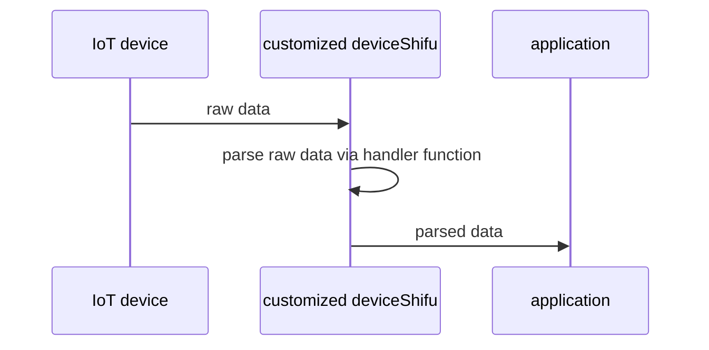
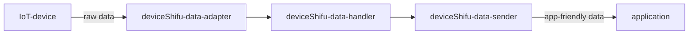
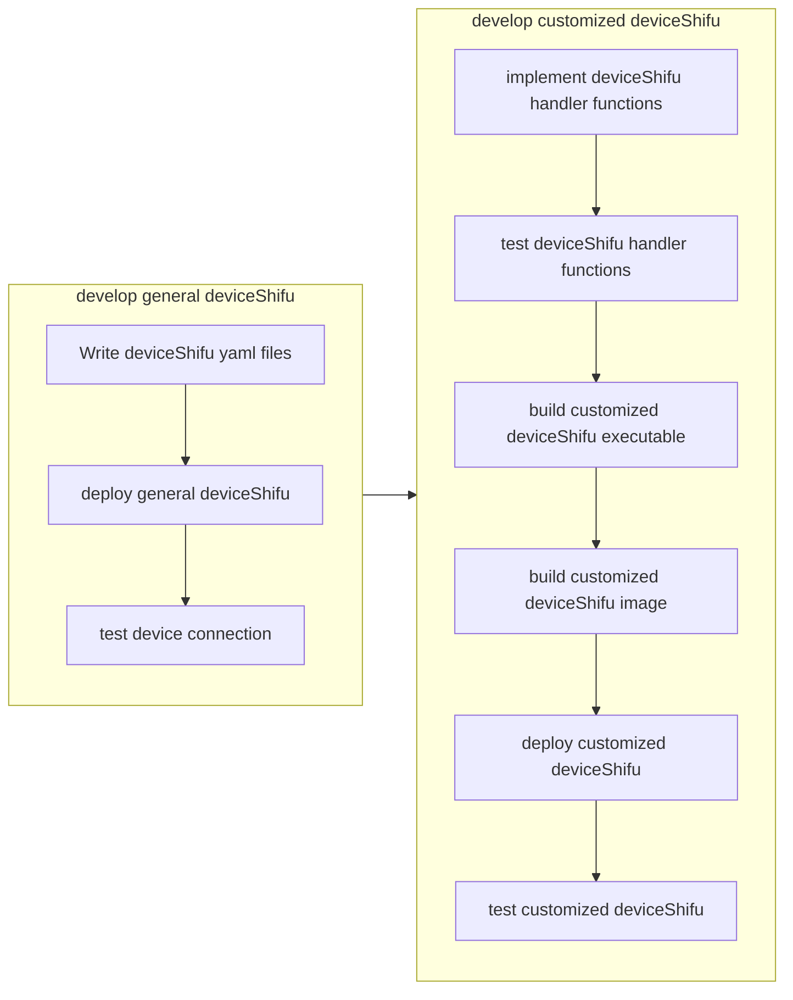

# Customized deviceShifu design

Customizing deviceShifu will enable deviceShifu to handle customized logic such as parsing data from devices.

## Data flow


Anything between `raw data` and `app-friendly data` are components in `deviceShifu`:


Examples:

`raw data` provided by IoT device:

```
root@nginx:/# curl http://deviceshifu-test.deviceshifu.svc.cluster.local/18000851;echo
```

```json
{
    "statusCode": "200",
    "message":"success",
    "entity":[{
        "deviceId":"20990922009",
        "datatime":"2022-06-30 07:55:51",
        "eUnit":"℃",
        "eValue":"37",
        "eKey":"e3",
        "eName":"atmosphere temperature",
        "eNum":"101"
    },
    {
        "deviceId":"20990922009",
        "datatime":"2022-06-30 07:55:51",
        "eUnit":"%RH",
        "eValue":"88",
        "eKey":"e4",
        "eName":"atmosphere humidity",
        "eNum":"102"
    }]
}
```

`parsed data` required by application:

```json
{
    [{
        "code":"20990922009",
        "name":"atmosphere temperature",
        "val":"37",
        "unit":"℃",
        "exception":"temperature is too high"
    },
    {
        "code":"20990922009",
        "name":"atmosphere humidity",
        "val":"88",
        "unit":"",
        "exception":"humidity is too high"
    }]
}
```

## Developer workflow



## Implementation

By default, `deviceShifu` will provide raw data from physical device to the applications.

To make `deviceShifu` able to "translate" the raw data to a more application-friendly format as well as filter out unneeded data, we can use the SDK to modify `deviceShifu` files, for example, we have:

`deviceShifu.py` where developers can edit this file in the following steps:

1. create a handler function, such as `check_regular_measurement_exception`.
2. register the handler function by editing `register_handlers`.

By default, `deviceShifu` will use the default command handler to process the data of each instruction, and calling the endpoint of the instruction will give a response of raw data from device. 

If user registers the custom handler and its associated instruction by calling register_handler, `deviceShifu` will switch to use the custom handler for that instruction. As a result, a call to the endpoint of that instruction will respond the processed data instead of raw data.

```python
class DeviceShifu():
    def __init__(self):
        self.register_handlers()

    def register_handlers(self):
        // register_handler(handler, instruction)
        self.register_handler(self.translate_data_from_sensor_a, "humidity")

    def start(self):

    # User defined callback handler functions
    # To debug, simply print to stdout and access from kubectl logs (we should have shifuctl too!)
    def translate_data_from_sensor_a(raw_data):
        new_data = []
        raw_loaded = json.load(raw_data)
        # translate the raw data to new data

        entities = raw_loaded["entity"]
        for i in range(len(entities)):
            new_data_entry = {"code": entities[i]["deviceId"],
                            "name": entities[i]["eName"],
                            "val": entities[i]["eValue"],
                            "unit": entities[i]["eUnit"],
                            "exception": check_regular_measurement_exception(entities[i]["eName"], entities[i]["eValue"])}
            new_data.append(new_data_entry)
        return new_data

```
and we can have helper and constants like this:
```python
    TEMPERATURE_MEASUREMENT = "atmosphere temperature"
    HUMIDITY_MEASUREMENT = "atmosphere humidity"


    def check_regular_measurement_exception(measurement_name, measurement_value):
        exception_message = ""
        if measurement_name == TEMPERATURE_MEASUREMENT:
            if int(measurement_value) > 35:
                exception_message = "temperature is too high"
        elif measurement_name == HUMIDITY_MEASUREMENT:
            if int(measurement_value) > 60:
                exception_message = "humidity is too high"

        return exception_message


```

`deviceShifu.py` developers shouldn't edit this file.

```python
def main():
    ds = DeviceShifu()
    ds.start()
```

## Internal structure of data
`deviceShifu`'s handling of data contains 4 components: data-adapter, data-handler, data-provider, data-cache:

1. **data-adapter** is responsible for receiving data from physical device. `deviceShifu` loads the driver and enables the data flow from physical device to data-adapter.
2. **data-handler** has custom-implemented handlers that process the data in action, handler's callback is invoked every time new data comes.
3. **data-provider** is the portal for actively sending data to applications or for applications to ask for data.
4. **data-cache** is cutsomizable to store data used very frequently.

## Internal data flow
