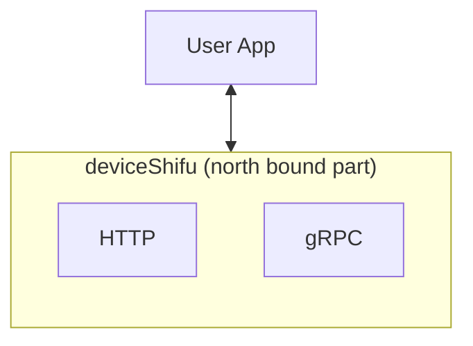
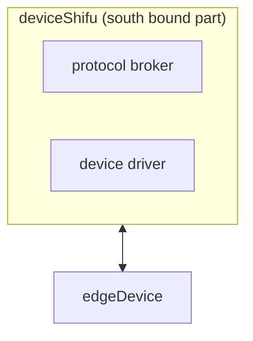
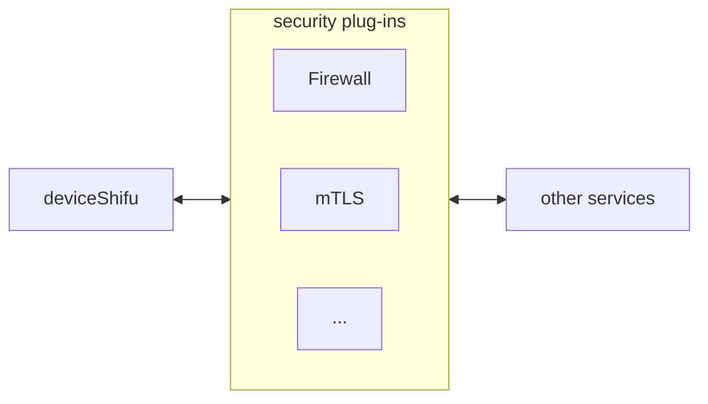

# deviceShifu 高层设计

***deviceShifu*** 是 ***Shifu*** 用户所写的应用于 ***Shifu*** 本身交互的唯一入口。所以 ***Shifu*** 用户绝大多数时间只需要和 ***deviceShifu*** 交互即可，也是 ***Shifu*** 用户最需要了解的 ***Shifu*** 组件。***deviceShifu*** 是IoT设备在 ***Shifu*** 中的结构性数字孪生，以微服务的形式存在。其底层是Kubernetes的Pod。

## 设计目标和非目标

### 设计目标

#### 低资源消耗

因为 ***Shifu*** 本质上就是由若干个 ***deviceShifu*** 组成的，所以在一个有上千种设备的复杂场景里， ***Shifu*** 里面也会有上千个 ***deviceShifu***。所以，***deviceShifu***的资源消耗一定要非常低。

#### 多态

***deviceShifu*** 需要能够成为任意设备的数字孪生。但是物联网设备太多太杂了，我们怎么才能把这么多非标准化的设备虚拟化成标准的 ***deviceShifu***呢？这就需要多态的设计了。而多态的底层实现则依赖于完全模块化的设计。我们在下面会有更具体的架构设计讲解。

#### 无状态

***deviceShifu*** 会缓存一部分来自于设备与应用的数据，但持久化存储应储存在独立的数据库中。

#### 跨平台

***deviceShifu*** 可以运行在所有主要平台上，包括但不限于 x86/64, ARM64 等。

### 设计非目标

#### 高并发

因为高并发的流量会经过设备与 ***deviceShifu*** 之间的broker，所以 ***deviceShifu*** 本身并不需要处理高并发的情况。

#### 高可用

等等！为什么会有组件的设计目标里没有高可用呢？！先别急，这是因为 ***deviceShifu*** 底层是Kubernetes的Pod。而Kubernetes的Deployment可以通过replica的方式给Pod创建若干个复制，来实现高可用。因此， ***Shifu***的用户可以根据自己的资源情况，给每一个 ***deviceShifu*** 非常轻松地创建若干个复制，来实现前所未有的超高可用性！下表阐明了 ***deviceShifu*** 副本数量和可用性之间的关系。
| ***deviceShifu*** 副本数量 | 可用性 |
|--|--|
| 1 | 99% |
| 2 | 99.99% |
| 3 | 99.9999% |

### 组件

***deviceShifu*** 的组件主要分三方面，网络、存储和计算。
#### 网络

***deviceShifu*** 的网络组件主要分为北向、南向、东西向和安全组件。

##### 北向
如下图所示，***deviceShifu*** 主要与用户的应用进行北向通信。
因此，***deviceShifu*** 的北向通信组件以http与gRPC等web通信方式为主。

##### 南向
如下图所示，***deviceShifu*** 主要与 ***edgeDevice***进行南向通信。
因此，***deviceShifu*** 的南向通信组件以协议与驱动等IoT通信方式为主。

##### 东西向

##### 安全

