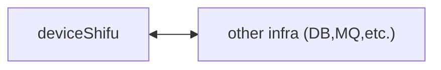
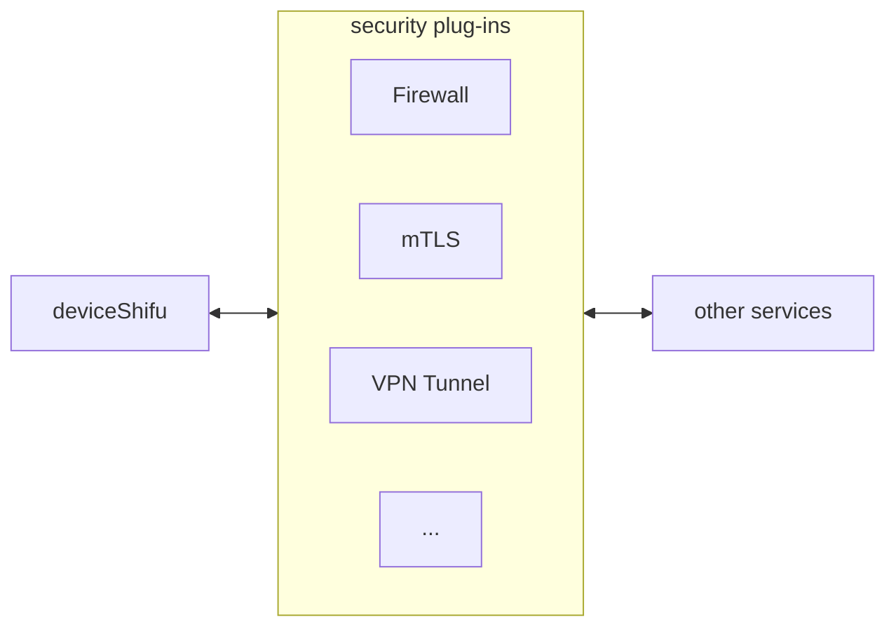
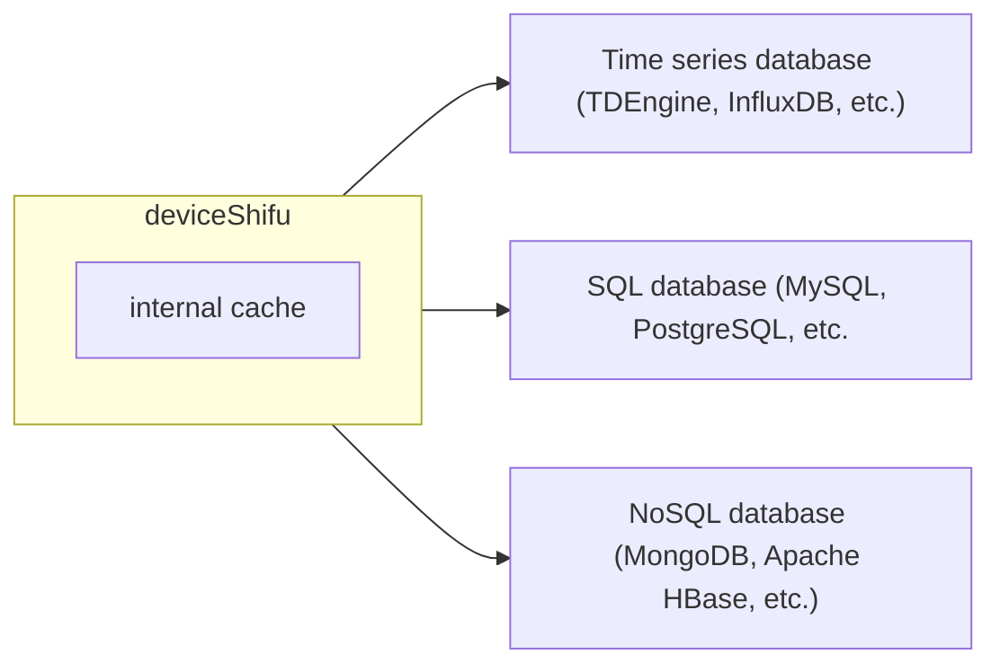
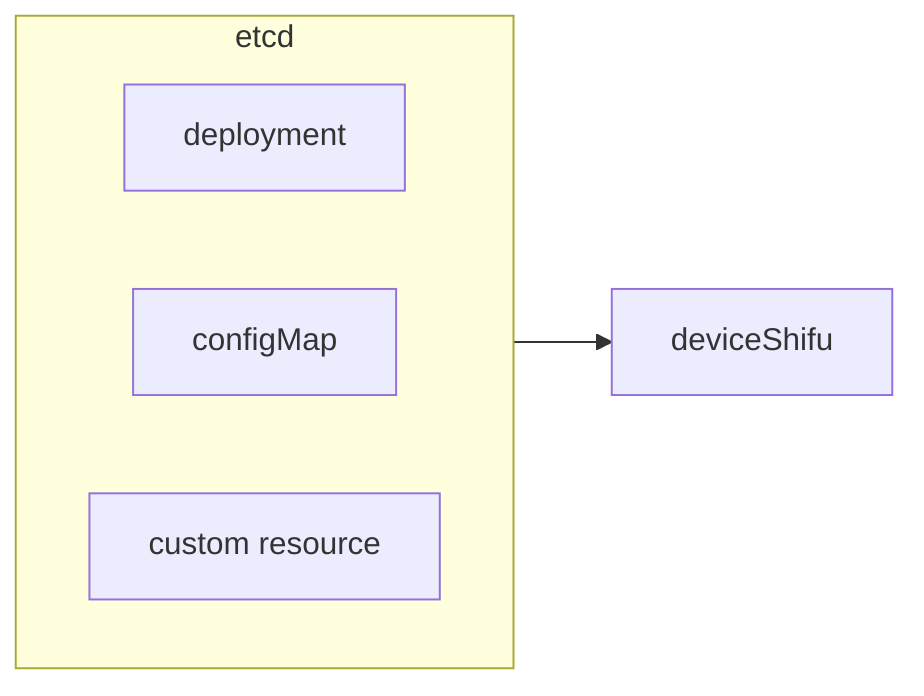
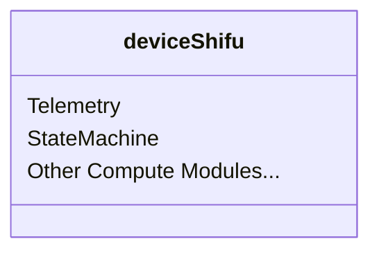

- [deviceShifu 高层设计](#deviceshifu-高层设计)
  - [设计目标和非目标](#设计目标和非目标)
    - [设计目标](#设计目标)
      - [低资源消耗](#低资源消耗)
      - [多态](#多态)
      - [无状态](#无状态)
      - [跨平台](#跨平台)
    - [设计非目标](#设计非目标)
      - [高并发](#高并发)
      - [高可用](#高可用)
    - [架构](#架构)
      - [网络](#网络)
        - [北向](#北向)
        - [南向](#南向)
        - [东西向（复用北向）](#东西向复用北向)
        - [安全](#安全)
      - [存储](#存储)
        - [数据面 Data Plane](#数据面-data-plane)
        - [控制面 Control Plane](#控制面-control-plane)
      - [计算](#计算)
# deviceShifu 高层设计

***deviceShifu*** 是 ***Shifu*** 用户所写的应用于 ***Shifu*** 本身交互的唯一入口。所以 ***Shifu*** 用户绝大多数时间只需要和 ***deviceShifu*** 交互即可，也是 ***Shifu*** 用户最需要了解的 ***Shifu*** 组件。***deviceShifu*** 是IoT设备在 ***Shifu*** 中的结构性数字孪生，以微服务的形式存在。其底层是Kubernetes的Pod。

## 设计目标和非目标

### 设计目标

#### 低资源消耗

因为 ***Shifu*** 本质上就是由若干个 ***deviceShifu*** 组成的，所以在一个有上千种设备的复杂场景里， ***Shifu*** 里面也会有上千个 ***deviceShifu***。所以，***deviceShifu***的资源消耗一定要非常低。

#### 多态

***deviceShifu*** 需要能够成为任意设备的数字孪生。但是物联网设备太多太杂了，我们怎么才能把这么多非标准化的设备虚拟化成标准的 ***deviceShifu***呢？这就需要多态的设计了。而多态的底层实现则依赖于完全模块化的设计。我们在下面会有更具体的架构设计讲解。

#### 无状态

***deviceShifu*** 会缓存一部分来自于设备与应用的数据，但持久化存储应储存在独立的数据库和文件系统中。

#### 跨平台

***deviceShifu*** 可以运行在所有主要平台上，包括但不限于 x86-64, ARM 64 等。

### 设计非目标

#### 高并发

因为高并发的流量会经过设备与 ***deviceShifu*** 之间的broker，所以 ***deviceShifu*** 本身并不需要处理高并发的情况。

#### 高可用

等等！为什么会有组件的设计目标里没有高可用呢？！先别急，这是因为 ***deviceShifu*** 底层是Kubernetes的Pod。而Kubernetes的Deployment可以通过replica的方式给Pod创建若干个复制，来实现高可用。因此， ***Shifu***的用户可以根据自己的资源情况，给每一个 ***deviceShifu*** 非常轻松地创建若干个复制，来实现前所未有的超高可用性！下表阐明了 ***deviceShifu*** 副本数量和可用性之间的关系。
| ***deviceShifu*** 副本数量 | 可用性 |
|--|--|
| 1 | 99% |
| 2 | 99.99% |
| 3 | 99.9999% |

### 架构

***deviceShifu*** 的架构主要分三方面，网络、存储和计算。
#### 网络

***deviceShifu*** 的网络组件主要分为北向、南向、东西向和安全组件。
注：以下讨论均在同一个网段内，跨网段的设计会在未来更新。
##### 北向
如下图所示，***deviceShifu*** 主要与用户的应用进行北向通信。
因此，***deviceShifu*** 的北向通信组件以http与gRPC等web通信方式为主。

##### 南向
如下图所示，***deviceShifu*** 主要与 ***edgeDevice***进行南向通信。
因此，***deviceShifu*** 的南向通信组件以协议与驱动等IoT通信方式为主。

##### 东西向（复用北向）
如下图所示，***deviceShifu*** 主要与包括数据库在内的其他infra进行东西向通信。因此，***deviceShifu*** 的东西向通信组件会直接使用北向的通信组件，以http与gRPC等web通信方式为主。

##### 安全
因为 ***Shifu*** 运行在Kubernetes上，所以一切Kubernetes的安全策略与组件都可以用来保护 ***Shifu*** 有关组件的安全。

#### 存储

因为 ***deviceShifu*** 的设计是无状态的，所以它只会缓存数据，而不会有数据面的持久化存储。
数据面的持久化存储会由数据库和文件系统等存储组件来完成。而控制面的持久化存储则依赖Kubernetes的CRD机制存储在etcd中。

注：以下示意图中没有消息队列等组件，请读者根据自身的场景需求进行进一步设计。

##### 数据面 Data Plane
***deviceShifu*** 的数据面存储结构如下：

##### 控制面 Control Plane
***deviceShifu*** 的控制面存储结构如下：

#### 计算

由于计算的需求过于多样化，***deviceShifu*** 的计算组件会在未来根据开发者的需求来添加。
目前已有的组件有：
1. 周期性执行任务（典型应用：数据采集）
2. 有限状态机（典型应用：流程自动化）

如果读者对更多的计算组件有需求，请[点击这里](https://github.com/Edgenesis/shifu/issues)建立一个issue，把你的想法告诉我们！

***deviceShifu*** 的计算架构示意图如下：

