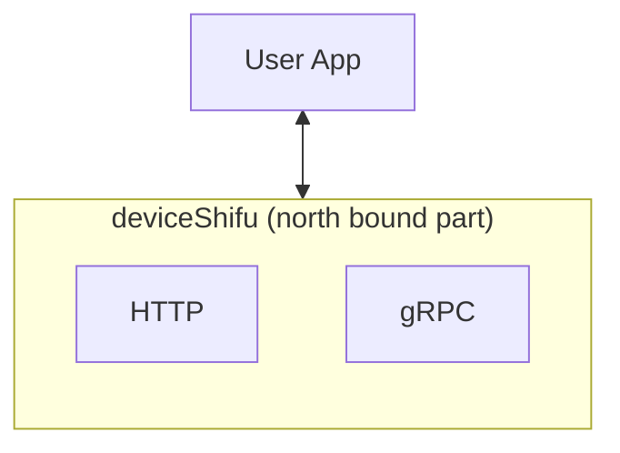
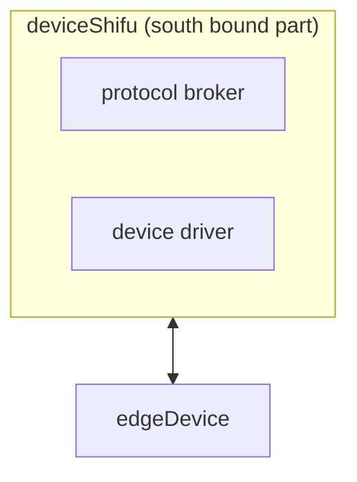
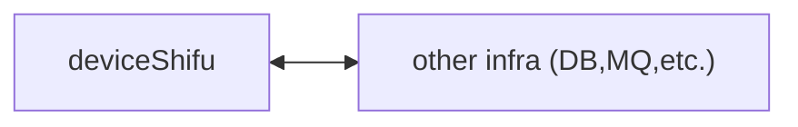
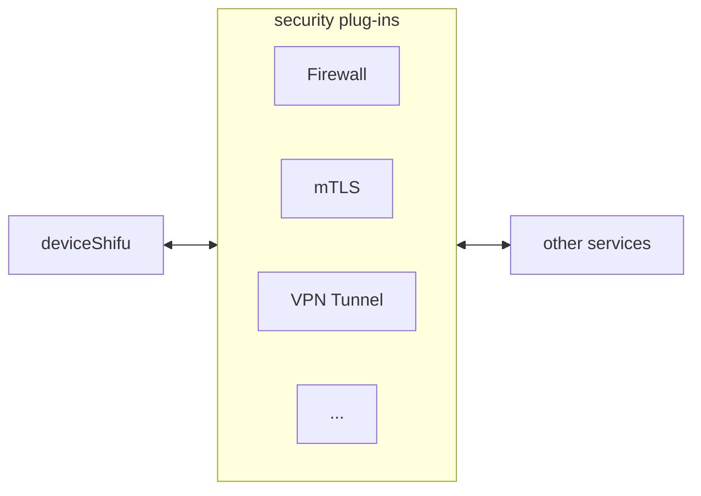
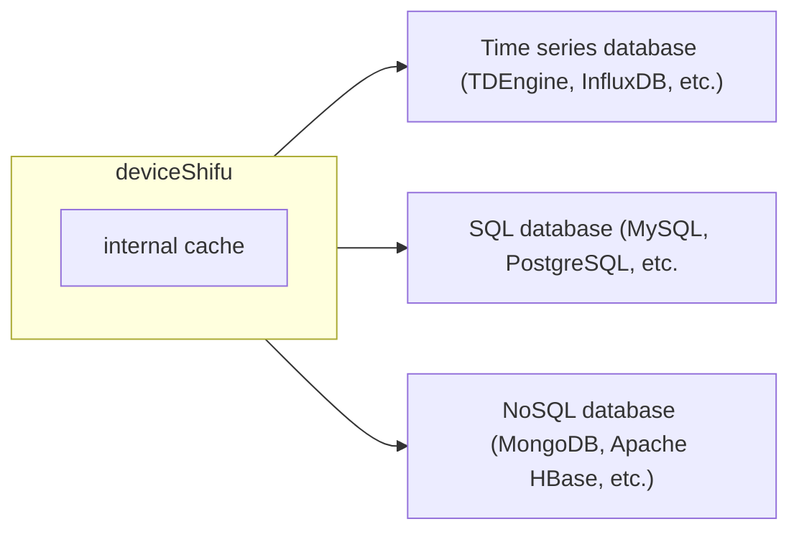
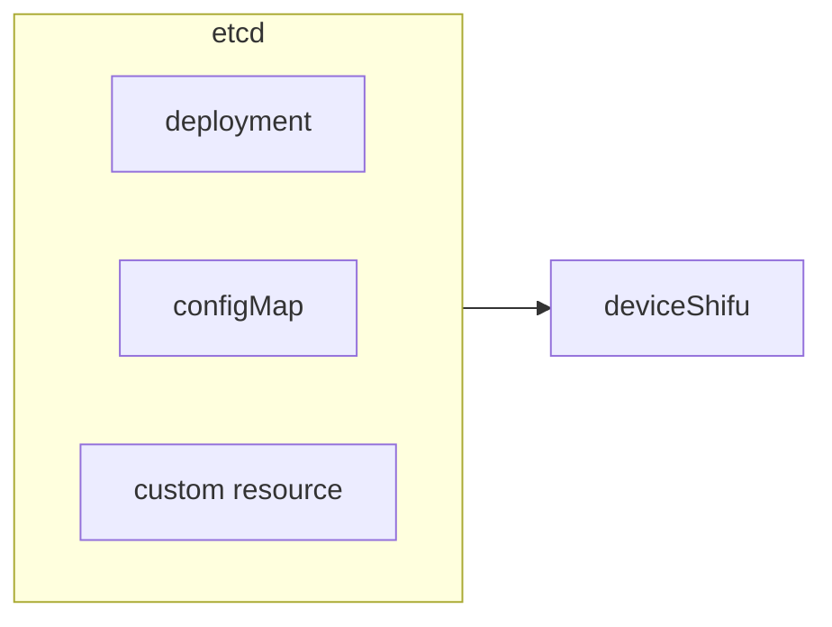
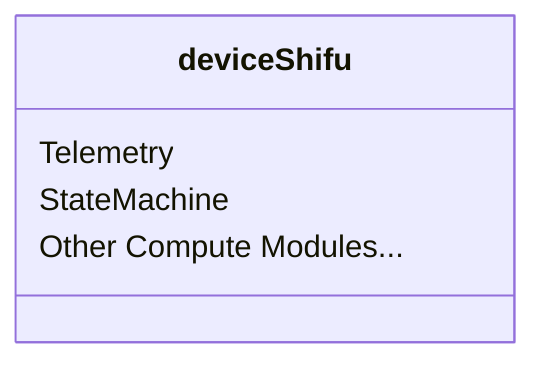

- [deviceShifu high-level design](#deviceshifu-high-level-design)
  - [Design goals and non-goals](#design-goals-and-non-goals)
    - [Design goals](#design-goals)
      - [Lightweight](#lightweight)
      - [Polymorphism](#polymorphism)
      - [Stateless](#stateless)
      - [Cross platform](#cross-platform)
    - [Design non-goals](#design-non-goals)
      - [High concurrency](#high-concurrency)
      - [Highly available](#highly-available)
    - [Architecture](#architecture)
      - [Networking](#networking)
        - [North bound](#north-bound)
        - [South bound](#south-bound)
        - [Horizontal（Reusing North bound）](#horizontalreusing-north-bound)
        - [Security](#security)
      - [Storage](#storage)
        - [Data Plane](#data-plane)
        - [Control Plane](#control-plane)
      - [Compute](#compute)
# deviceShifu high-level design 
***deviceShifu*** is the sole interface between user developed apps and ***Shifu*** itself. Therefore, ***Shifu*** users will deal with ***deviceShifu*** most of the time. This also means ***Shifu*** users should know ***deviceShifu*** the best. ***deviceShifu*** is a ***structural digital twin*** for a connected device. Under the hood, it is a micro-service backed by a Kubernetes pod.

## Design goals and non-goals

### Design goals

#### Lightweight
In a complex scenario with more than a thousand kinds of devices, ***Shifu*** will have more than a thousand ***deviceShifu*** in it. This is because ***Shifu*** is acutally composed of multiple ***deviceShifu*** instances. Therefore, the resource consumption of ***deviceShifu*** has to be extremely low.

#### Polymorphism
***deviceShifu*** needs to become the digital twin for any IoT device. But how do we standardize so many IoT devices and virtualize them into ***deviceShifu***? That's where polymorphism comes into play. In order to achieve true polymorphism, we need to make ***deviceShifu*** 100% modular. We will talk about architectural design in the following sections.

#### Stateless
***deviceShifu*** will cache some data come from devices and applications, but it's database and file system's job to handle persistent store.

#### Cross platform
***deviceShifu*** can run on all major platforms, including but not limited to x86-64, ARM 64, etc.

### Design non-goals

#### High concurrency

Since high concurrency connections will be handled by the broker between a device and its ***deviceShifu***, therefore ***deviceShifu*** itself doesn't need to handle high concurrency scenarios.

#### Highly available
Wait! Why there's no HA in ANY component's design goals? Relax, this is because ***deviceShifu*** is a Kubernetes pod under the hood.
Kubernetes's Deployment creates multiple replicas for a pod to achieve HA. Therefore, ***Shifu*** users can create multiple replicas for each ***deviceShifu*** depending on the compute resources. This way, you can achieve unprecedented high availability! The table below demonstrates ***deviceShifu***'s replica # v.s. its availability.
| ***deviceShifu*** replica # | availability |
|--|--|
| 1 | 99% |
| 2 | 99.99% |
| 3 | 99.9999% |

### Architecture
***deviceShifu***'s achitecture consists of networking, storage and compute.

#### Networking
***deviceShifu***'s networking components consists of north bound, south bound, horizontal and security plug-ins.
Note: the following discussion focuses on LAN cases. Designs beyond local network will be updated in the future.

##### North bound
As shown below, ***deviceShifu*** mainly communicates with user applications through north bound plug-ins.
Therefore, ***deviceShifu***'s north bound plug-ins focus on web communications, such as http and gRPC.

##### South bound
As shown below, ***deviceShifu*** mainly communicates with ***edgeDevice*** through south bound plug-ins.
Therefore, ***deviceShifu***'s south bound plug-ins focus IoT communications, such as drivers and protocols.

##### Horizontal（Reusing North bound）
In horizontal cases, ***deviceShifu*** mainly communicates with other infrastructure services. Therefore, ***deviceShifu*** reuses north bound plug-ins to communicate with such services through web communications such as http and gRPC.

##### Security
Since ***Shifu*** runs on top of Kubernetes, therefore all Kubernetes security addons/solutions can be directly used to protect ***Shifu***'s security.

#### Storage
Since ***deviceShifu*** is stateless by design, it only caches data without persistent store.
Persistent store of data plane is handled by storage plug-ins like databases/file systems.
Persistent store of control plane is handled by etcd through the Kubernetes CRD mechanism. 

Note: There's no additional components like message queues. Please add those components based on your scenario.

##### Data Plane
***deviceShifu***'s data plane storage is shown below:

##### Control Plane
***deviceShifu***'s control plane storage is shown below:

#### Compute
Since the need of compute is very fragmented, ***deviceShifu*** will add more compute plug-ins based on developers' feedbacks.
Currently we have the following compute plug-ins:
1. Periodical task execution (sample usage: data collection)
2. Finite state machine (sample usage: process automation)

If you have additional needs for compute plug-ins, please [click here](https://github.com/Edgenesis/shifu/issues) to create an issue and tell us what's up in your mind!

***deviceShifu***'s compute architecture diagram is shown below:

