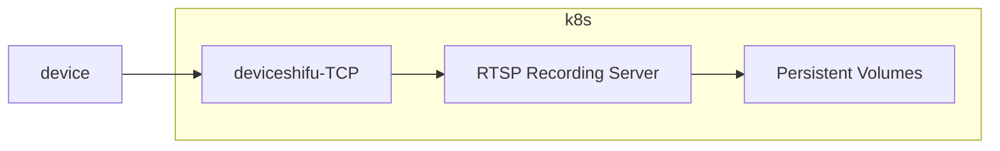

# RTSP recording application 

User can use this application to watch rtsp using ffmpeg or other third-party package to store the stream into PV in other host which has RTX 4090.

## Goal

application running in the kubernetes allow user to connect RTSP server, and record the rtsp stream into file like mp4 / flv and so on, user can export file out of kubernetes.

## General Design

The application is a container running in the kubernetes, which can store the rtsp stream into a file like mp4 / flv and so on, user can export file out of kubernetes with the instruction manual.

By Default, the application connect to the deviceShifu-TCP to achieve deviceShifu-RTSP, so that user can record the RTSP Stream into file, or watch the RTSP Stream in VLC from deviceShifu.

## Detailed Design



We need to store the video in pieces, each clip is 1 hour by default, the user can set this option, user can customize the path where the files saved

this application can implemenet with a shell script, or a Binary files and so on
ffmpeg example:
```bash
ffmpeg -i rtsp://[RTSP_URL] -c copy -map 0 -segment_time 300 -f segment video/output%03d.mp4
```

The application provides two interfaces, such as `/record/on` and `/record/off`, to control the record state and can stop the record gracefully.

Create PVC and PV need Separate with other deploy to avoid user delete pv by mistake. 
```yaml
apiVersion: v1
kind: PersistentVolume
metadata:
  name: <devicename>-pv
  namespace: deviceshifu
  labels:
    pv: <devicename>-pv
spec:
  capacity:
    storage: 10Gi
  volumeMode: Filesystem
  accessModes:
    - ReadWriteOnce
  persistentVolumeReclaimPolicy: Retain
  storageClassName: slow
---
apiVersion: v1
kind: PersistentVolumeClaim
metadata:
  name: <devicename>-pvc
spec:
  resources:
    requests:
      storage: 10Gi
  volumeMode: Filesystem
  accessModes:
    - ReadWriteOnce
  selector:
    matchLabels:
      pv: <devicename>-pv
```
recording server deployment.yaml
```yaml
# deployment.yaml
...
- env:
  RTSPServerAddress: ""
  UserName: ""
  PasswordSecret: "" # this just a case, secret using the secret env mode
  FileSavePath: ""
...
volumeMounts:
- name: storage-pv
  mountPath: /data
...
volumns:
- name: storge-pv
  persistentVolumeClaim:
    claimName:  pvc-name
    optional: true
```

### Testing Plan

We can use Hikvision / Dahua Camera, create a deviceShifu-TCP and application to connect it and record the stream into file. Meanwhile we can create a mock-rtsp server or build a mock-rtsp device docker image to test.