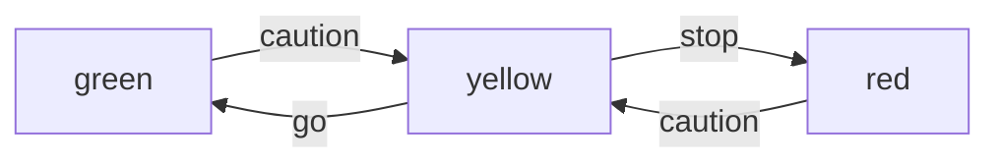

# Shifu FSM Design
Shifu FSM stands for Shifu Finite State Machine. It is a workflow control system that allows users to control the behavior of the device based on different states.

## Control Flow
A traffic light's FSM might look like this:


### State
A state is a condition or status of the system. It represents a specific moment or situation in the execution of the machine.

### Action
An action here is just an instruction in the configmap. Each state can define a set of instructions along with the next state the device will end up in when receiving the action. If a state receives an unsupported action, it will simply rejects the action.

Take the above control flow as an example, `green` receives `caution` and transit to `yellow`. `yellow` receives `stop` and transit to `red`. `red` receives `caution` and transit back to `yellow`, `yellow` receives `go` action and transit to `green`.

### Forbid
Forbid will be a list of actions that are not allowed to take in the given state. In the traffic light example, a `red` state would not allowed to take a `go` action directly.


## High level design
We can reuse a lot of existing design and implementations to achieve the FSM functionality. We can embed the entire FSM as part of our configmap, along with instructions and telemetries. 
We can add a state field inside `edgedeivce` to represent current state of the device, and since edgedevice is stored in `etcd`, it's also good for fail-recovery.

## Detailed Design
### Configmap
We will add a section in conifgmap as the FSM setting, like:

```yaml
apiVersion: v1
kind: ConfigMap
metadata:
  name: http-configmap-0.0.1
  namespace: deviceshifu
data:
#    available instructions
  instructions: |
    instructions:
      caution:
      stop:
      go:
      status:
  telemetries: |
    telemetries:
      device_health:
        properties:
          instruction: status
          initialDelayMs: 1000
          intervalMs: 1000
  fsm: |
    states:
      red: 
        actions:
          caution:
            next_state: yellow
        forbid:
          go:    
      green:
        actions:
          caution:
            next_state: yellow
        forbid:
          stop:
      yellow:
        actions:
          go:
            next_state: green
          stop:
            next_state: red     
    startingState: red
```
`states` contain the states of the FSM. Each `state` contains a set of actions it can take, and a forbid list for the actions it not allowed to take. 

Take the above traffic light FSM as an example. The FSM has 3 states, `red`, `yellow` and `green`. If the device is in `green` state, it will take an caution action to become `yellow` state and it will reject `stop` action. `yellow` state will transit to `green` state on `go` action and to `red` state on `stop` action. 
For any state, when received instructions listed in instruction sessions but not either in actions or in forbid list, it will stay in the same after receive the action.
The FSM section will also include a `startingState` field, which indicates which state the FSM should be starting with.

### EdgeDevice
```yaml
apiVersion: shifu.edgenesis.io/v1alpha1
kind: EdgeDevice
metadata:
  name: edgedevice-traffic-light
  namespace: devices
spec:
  sku: "Traffic Light" 
  connection: Ethernet
  address: traffic-light.devices.svc.cluster.local:11111
  protocol: HTTP
  customMetadata:
    Vendor: Quicktron
    Type: AMR
    Model: M60
    LoadType: Lifting beneath rack
    HWrevision: v2
    Dimensions: 956*730*240 mm
    RatedLoad: Rated load
    BatteryCapacity: 48V/36Ah
    ChargingTime: 9h
    AmbientTemperature: 0-45C
  state: green
```
We will add a new filed `state` in `edgeDevice` spec to represent current state of the device.

### Code

```golang
// DeviceShifuConfig data under Configmap, Settings of deviceShifu
type DeviceShifuConfig struct {
	DriverProperties         DeviceShifuDriverProperties
	Instructions             DeviceShifuInstructions
	Telemetries              *DeviceShifuTelemetries
	CustomInstructionsPython map[string]string `yaml:"customInstructionsPython"`
	ControlMsgs              map[string]string `yaml:"controlMsgs,omitempty"`
	FSM                      *DeviceShifuFSM
}

type DeviceShifuFSM struct {
	States        map[string]*DeviceShifuState `yaml:"states"`
	StartingState *string                       `yaml:"startingState"`
}

type DeviceShifuState struct {
	Actions map[string]*DeviceShifuAction `yaml:"actions"`
	Forbid  []string                      `yaml:"forbid"`
}

type DeviceShifuAction struct {
	NextState string `yaml:"next_state"`
}
```
We will add a new filed in `DeviceShifuConfig` called `FSM` to represent our finite state machine setup. We also created few new structs to represent state and actions.

```golang
// EdgeDeviceSpec defines the desired state of EdgeDevice
type EdgeDeviceSpec struct {
	// INSERT ADDITIONAL SPEC FIELDS - desired state of EdgeDevice
	// Important: Run "make" to regenerate code after modifying this file

	// Sku specifies the EdgeDevice's SKU.
	Sku              *string            `json:"sku,omitempty"`
	Connection       *Connection        `json:"connection,omitempty"`
	Address          *string            `json:"address,omitempty"`
	Protocol         *Protocol          `json:"protocol,omitempty"`
	ProtocolSettings *ProtocolSettings  `json:"protocolSettings,omitempty"`
	CustomMetadata   *map[string]string `json:"customMetadata,omitempty"`
	State            *string            `json:"state"`
}
```
We will add a new filed called `State` in `EdgeDeviceSpec` to represent the current state of the device.

We will handle the FSM transition in `commandHandleFunc` inside each deviceShifu subtype/
```golang
func (handler DeviceCommandHandlerHTTP) commandHandleFunc() http.HandlerFunc {
	return func(w http.ResponseWriter, r *http.Request) {
        // Get associated instruction and current state
        // Check if we have fsm enabled.
        state := fsm.States[state]
        // instruction is a transit action
        if val, ok := state.Actions[instruction]; ok {
            // update current state of the edgedevice
        }
        if val, slices.Contains(state.Forbid, instruction) {
            // reject the instruction with 400
        }
        // else don't do anything with the current state.
    
    }
}
```

### Test Plan
Test cases need to cover basic situations like each states only have single forward actions and also complex situations like each states support multiple direction actions and FSM with loops.