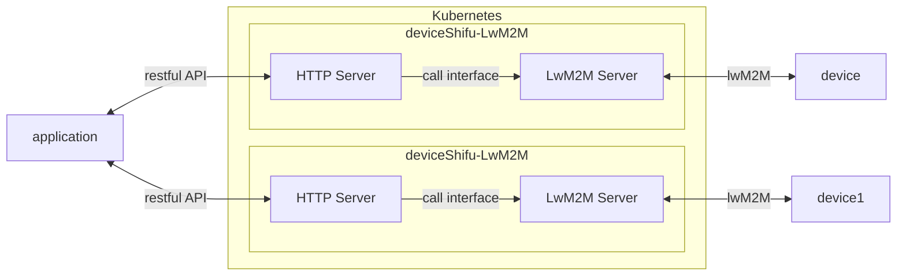
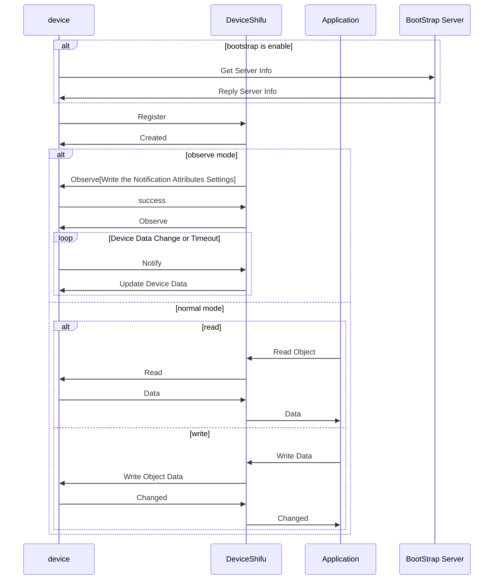

# deviceShifu LwM2M Design

deviceShifu LwM2M allow shifu connect device using [LwM2M protocol](https://omaspecworks.org/what-is-oma-specworks/iot/lightweight-m2m-lwm2m/).

This document outlines the design for integrating the [Lightweight Machine to Machine (LwM2M) protocol](https://omaspecworks.org/what-is-oma-specworks/iot/lightweight-m2m-lwm2m/) into the deviceShifu framework to allow for the management of IoT devices.

## Goals

### Design Goal

- Create a deviceshifu-lwm2m type to enable users to connect devices using the lwM2M protocol.
- LwM2M protocol support both `read` and `write` requests.
- Datagram Transport Layer Security (DTLS) support.
- Resource observation or Notification.
- [LwM2M protocol using v1.0.x version](https://www.openmobilealliance.org/release/LightweightM2M/V1_0-20170208-A/OMA-TS-LightweightM2M-V1_0-20170208-A.pdf).
- LwM2M protocol under UDP.
  
### Design Non-Goal

- Support LwM2M v1.1.x or later version.
- Over TCP or other protocol.
- Bootstrap Server.

## Detail Design



The `deviceShifu-LwM2M` will represent each LwM2M object as an instruction that can be accessed through a RESTful API. The API will use the POST method for write operations and the GET method for read operations. The supported data formats for LwM2M v1.0 are TLV, JSON, Plain text, and Opaque.

deviceShifu-LwM2M's LwM2M server will handle Register, Update, De-register, Read, Write, Observe and Notify.

For each deviceshifu lwM2M should expose a UDP port for LwM2M communication.

deviceShifu-LwM2M support two kind of mode normal and observe mode.
- normal mode: just like the other deviceshifu, when call the instruction, deviceShifu will send Read or Write Request to deviceShifu and return response
- observe mode: this mode will set the min and max notify time, then device will notify data when data changed or timeout. deviceShifu will record data, and return the data store in the memory cache when call the instruction. and this kind of mode also support read and write operation.

deviceShifu will host a LwM2M server and listen on udp 3683(LwM2M default port) and http server(deviceshifu) on 8080.

the LwM2M server will handle register, update, de-register request from device and maintain the device info in the memory cache.

if the Object is in observe mode, LwM2M server also need to handle the notify request from device and update the data in the memory cache.

when the deviceShifu received the instruction before the device register, it will return error message. 



### Protocol Specification

Define data structures and types in Go for configuring and managing LwM2M communication:

```go
type LwM2MSettings struct {
	EndpointName string `json:"endpointName,omitempty"`
  	// +kubebuilder:default="None"
	SecurityMode *SecurityMode `json:"securityMode,omitempty"`
	DTLSMode     *DTLSMode     `json:"dtlsMode,omitempty"`

	CipherSuites []CiperSuite `json:"cipherSuites,omitempty"`
	PSKIdentity  *string      `json:"pskIdentity,omitempty"`
	PSKKey       *string      `json:"pskKey,omitempty"`
}

type DTLSMode string

const (
    DTLSModePSK DTLSMode = "PSK"
    // ...
)

type CiperSuite string

const (
	CiperSuite_TLS_ECDHE_ECDSA_WITH_AES_128_CCM   CiperSuite = "TLS_ECDHE_ECDSA_WITH_AES_128_CCM"
    // ...
)
```

If bootstrap server address is not empty, deviceShifu will send register request to bootstrap server, and get the server info, then send register request to deviceShifu.

```go
type LwM2MType string

type Properties struct {
    ObjectId            string      `json:"ObjectId"` // required example /3303/0
    DataFormat          LwM2MType   `json:"dataFormat"` // optional TLV/JSON/PlainText/Opaque default plaintext
    EnableObserve       bool        `json:"EnableObserve,omitempty"` // optional enable observe mode default false
    ObserveMinPeriod    int         `json:"ObserveMinPeriod,omitempty"` // optional work when enable observe default 10 seconds
    ObserveMaxPeriod    int         `json:"ObserveMaxPeriod,omitempty"` // optional work when enable observe default 60 seconds
}
```

### Serving requests

deviceShifu-LwM2M would take RESTful-style requests just as other deviceShifu do.

LwM2M supports both `GET` and `PUT` requests.

For read the data from device, the method signature looks like:
```
GET lwm2m.device.svc.cluster.local/{object1_name}
```
```go
LwM2MServer.Read(properties.ObjectId)
if properties.EnableObserver {
    cache.Update(properties.ObjectId, newValue)
}
return value
```

For write the data to device, the method signature looks like:
```
PUT lwm2m.device.svc.cluster.local/{object1_name}
```
```go
LwM2MServer.Write(properties.ObjectId, newValue)
if properties.EnableObserver {
    cache.Update(properties.ObjectId, newValue)
}
return success
```

For the LwM2MServer to handle the notify request from device, the method signature looks like:

```go
LwM2MServer := NewLwM2MServer()
LwM2MServer.Handle("/", handler)
...
go LwM2MServer.ListenAndServe()

// Refer to LwM2M documentation for function implementations
func HandleNotify(request,response) {
    cache.Update(request.ObjectId, request.Value)
}

func HandleRegister(request,response) {
    cache.Add(request.ObjectId, request.Value)
}

func HandleDeRegister(request,response) {
    cache.Delete(request.ObjectId)
}
```

## Testing Plan

- Using [Leshan](https://github.com/eclipse-leshan/leshan) as a LwM2M client use deviceshifu-LwM2M to connect to the device without bootstrap server.
- Using [Leshan](https://github.com/eclipse-leshan/leshan)'s bootstrap server and client use deviceshifu-LwM2M to connect to the device.
- Normal mode test: read and write data from device.
- Observe mode test: read and write data from device, and check the data change or timeout.