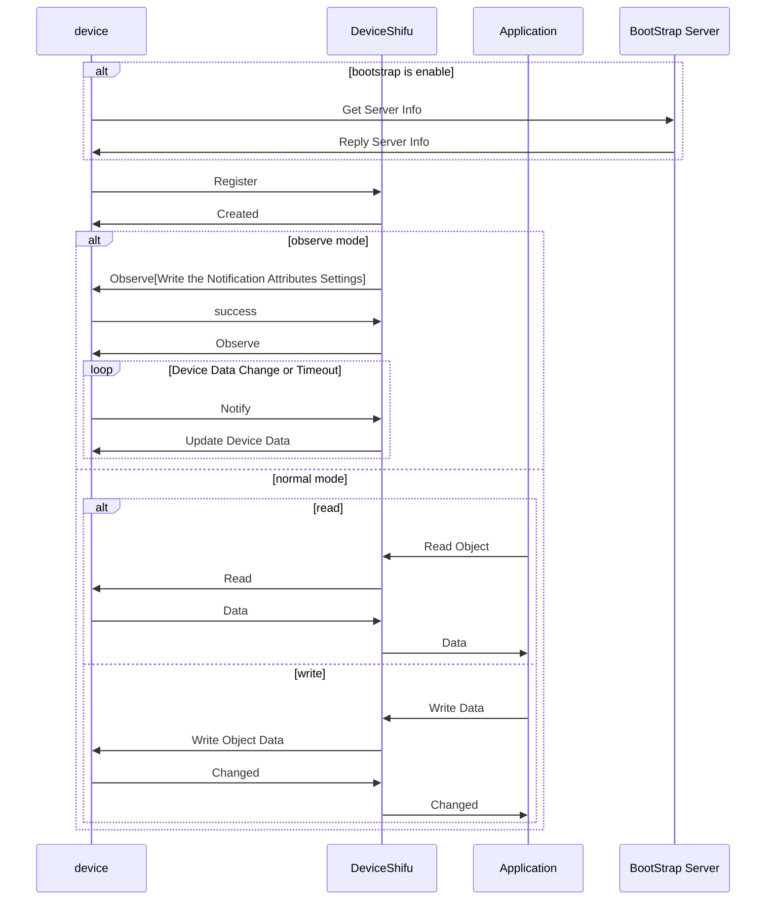

# DeviceShifu lwM2M Design

deviceShifu lwM2M allow shifu connect device using [lwM2M protocol](https://omaspecworks.org/what-is-oma-specworks/iot/lightweight-m2m-lwm2m/).

## Goals

### Design Goal

- Create a deviceShifu-lwm2m type allow user to connect device using lwM2M protocol.
- lwM2M protocol support both `read` and `write` requests.
- Resource observation or Notification
- lwM2M protocol using v1.0.x version.
- lwM2M protocol under UDP.
- 
### Design Non-Goal

- Support lwM2M v1.1.x or later version.
- DTLS support.
- Over TCP or other protocol.
- Bootstrap Server.

## Detail Design

For deviceShifu-lwM2M, make each object in lwM2M as instruction, and can read and write in by RESTful API, write using POST method, read using GET method.

lwM2M v1.0 only support TLV/JSON/Plain text/Opaque data format.

deviceShifu-lwM2M's lwM2M server will handle Register, Update, De-register, Read, Write, Observe and Notify.

deviceShifu-lwM2M support two kind of mode normal and observe mode.
- normal mode: just like the other deviceshifu, when call the instruction, deviceShifu will send Read or Write Request to deviceShifu and return response
- observe mode: this mode will set the min and max notify time, then device will notify data when data changed or timeout. deviceShifu will record data, and return the data store in the memory cache when call the instruction. and this kind of mode also support read and write operation.




### Protocol Specification

```go
type LwM2MSetting struct {
    EndpointName            string `json:"EndpointName,omitempty"`
    BootStrapServerAddress  string `json:"BootStrapServerAddress,omitempty"`
}
```

```go
type LwM2MType string

type Properties struct {
    ObjectId            string      `json:"ObjectId"` // required
    DataFormat          LwM2MType   `json:"dataFormat"` // optional TLV/JSON/PlainText/Opaque default plaintext
    EnableObserve       bool        `json:"EnableObserve,omitempty"` // optional enable observe mode default false
    ObserveMinPeriod    int         `json:"ObserveMinPeriod,omitempty"` // optional work when enable observe default 10 seconds
    ObserveMaxPeriod    int         `json:"ObserveMaxPeriod,omitempty"` // optional work when enable observe default 60 seconds
}
```


deviceShifu will host a lwM2M server and listen on udp 3683(lwM2M default port) and http server(deviceshifu) on 8080.
the lwM2M server will handle register, update, de-register request from device and maintain the device info in the memory cache.
if the Object is in observe mode, lwM2M server also need to handle the notify request from device and update the data in the memory cache.
when the deviceShifu received the instruction before the device register, it will return error message. 

### Serving requests

deviceShifu-lwM2M would take RESTful-style requests just as other deviceShifu do.
lwM2M supports both `GET` and `PUT` requests.

For read the data from device, the method signature looks like:
```
GET lwm2m.device.svc.cluster.local/{object1_name}
```
```go
lwM2MServer.Read(properties.ObjectId)
if properties.EnableObserver {
    cache.Update(properties.ObjectId, newValue)
}
return value
```

For write the data to device, the method signature looks like:
```
PUT lwm2m.device.svc.cluster.local/{object1_name}
```
```go
lwM2MServer.Write(properties.ObjectId, newValue)
if properties.EnableObserver {
    cache.Update(properties.ObjectId, newValue)
}
return success
```

For the lwM2MServer to handle the notify request from device, the method signature looks like:

```go
lwM2MServer := NewLwM2MServer()
lwM2MServer.Handle("/",handler)
...
go lwM2MServer.ListenAndServe()

// code implement reference to lwM2M documentation
```

