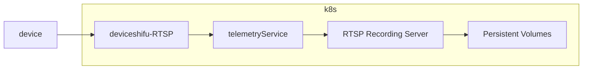

# deviceShifu RTSP overall design

deviceShifu-RTSP allows shifu connect to rtsp server and save the video into file. User can watch rtsp video using media player like VLC and get history video file from PV.

## Goal

Create a deviceShifu-RTSP using third-party library and allow user to connect RTSP server, and record the rtsp stream into file like mp4 / flv and so on, user can export file out of k8s.

## General Design

deviceShifu-RTSP will receive RESTful style request like other, then transfer the request into RTSP method calls and send it to RTSP Server, meanwhile deviceShifu-RTSP provide a RTSP address which forward the RTSP stream from the target RTSP server.

## Detailed Design

### Protocol Specification

deviceShifu-RTSP provide a RTSP server to forward RTSP stream and HTTP Server to handle Request.

```go
type ProtocolSettings struct {
    MQTTSetting *MQTTSetting `json:"MQTTSetting,omitempty"`
    ....
+   RTSPSetting *RTSPSetting `json:"RTSPSetting,omitempty"`
}

type RTSPSetting struct {
    Username        string `json:"username,omitempty"`
    PasswordSecret  string `json:"passwordSecret,omitempty"`
}
```

If user turn on Record, deviceShifu will using telemetry Service to push the rtsp stream to telemetry Service, and telemetry Service will forward the stream to the rtsp recording server to record the rtsp video into file.
```yaml
...
telemetry:
  telemetry:
    push_stream:
      instruction: stream
      pushSettings:
        telemetryCollectionService: rtsp_record_telemetry
        kind: stream
...
```
Create PVC and PV need Separate with other deploy to avoid user delete pv by mistake. 
```yaml
apiVersion: v1
kind: PersistentVolume
metadata:
  name: <devicename>-pv
  namespace: deviceshifu
  labels:
    pv: <devicename>-pv
spec:
  capacity:
    storage: 10Gi
  volumeMode: Filesystem
  accessModes:
    - ReadWriteOnce
  persistentVolumeReclaimPolicy: Retain
  storageClassName: slow
---
apiVersion: v1
kind: PersistentVolumeClaim
metadata:
  name: <devicename>-pvc
spec:
  resources:
    requests:
      storage: 10Gi
  volumeMode: Filesystem
  accessModes:
    - ReadWriteOnce
  selector:
    matchLabels:
      pv: <devicename>-pv
```
recording server deployment.yaml
```yaml
# deployment.yaml
...
volumeMounts:
- name: storage-pv
  mountPath: /data
...
volumns:
- name: storge-pv
  persistentVolumeClaim:
    claimName:  pvc-name
    optional: true
```
### Recording Logic



We need to store the video in pieces, each clip is 1 hour by default, the user can set this option

ffmpeg example:
```bash
ffmpeg -i rtsp://[RTSP_URL] -c copy -map 0 -segment_time 300 -f segment video/output%03d.mp4
```
### Serving requests

deviceShifu-RTSP would take RESTful-style requests just as other deviceShifu do.
RTSP support like `stream` / `describe` / `record/start` / `record/stop` requests.

For `stream`, the method will forward or redirect the RTSP stream

For `describe`, the method will return the RTSP server info by RTSP `DESCRIBE` reponse

### Testing Plan

We can use Hikvision / Dahua Camera, create a deviceshifu-RTSP to connect it and test the methods. Meanwhile we can create a mock-rtsp server or build a mock-rtsp device docker image to test.
