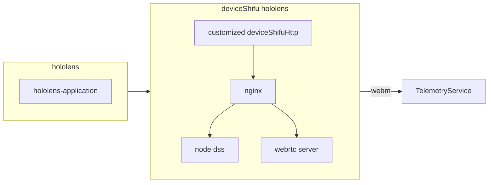

# DeviceShifu Hololens Design
Devceishifu Hololens act as a module that serves core functionality required by Hololens apps. 

###Flowchart:

## General Design
As a module, deviceShifu Hololens would consist 3 parts. Customized deviceshifuHttp would serve as the entry point of the entire module. Customized deviceShifuHTTP will forward the request it received from the client to nginx and nginx will route the request to node dss for signalling or to webRTC server for getting video or audio snippet. The entire module should be in a single deployment.

## Detailed
### DeviceShifuHTTP
We don't need to do particular changes to deviceShifuHTTP, we only need to add certain instructions into the configmap in order to allow deviceShifuHTTP to send requests to webRTC server and Node DSS.
```yaml
instructions: |
    instructions:
      offer:
      audio_recognition:
      image_recognition:
```

### Customized DeviceShifu
We need 2 customized deviceShifu to process the image and audio snippet passed by deviceShifuHTTP. 

```python
def processImage(rawData)
    image = rawData[audio]
    // process image
    return processed_image_json

def processAudio(rawData)
    audio = rawData[audio]
    // process audio
    return processed_audio_json
```

### Node DSS and Nginx
For node dss, we can use the existing node dss server as our signal server, we don't need to do any particular change, we only need to add it to a container and put it into the same pod. 
For nginx, we only need to configure it to route our requests to designated Node DSS or webRTC server and put it as a container to the same pod.


