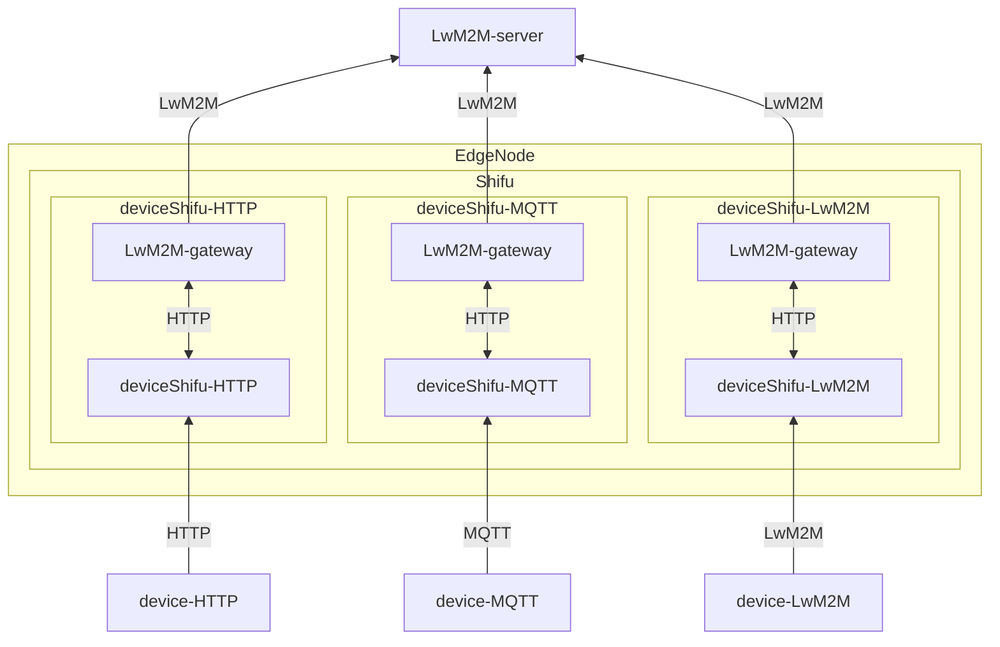

# LwM2M Gateway design

## Why need LwM2M Gateway

Telemetry service which serve push data from device to the data server, it didn't have the feature to pull data from the device and post data from cloud to device, while LwM2M normally needs to do it. In order to support this, a LwM2M Gateway is required to do this job.

So we need a gateway make deviceShifu to adapt the LwM2M protocol. to support pull data call from server and auto push data to the server.

## Goal

### Design Goal

- make device as a LwM2M device registered to the LwM2M server.
- Provide a way to connect deviceShifu to the LwM2M server.
- LwM2M Server can read, write and execute the deviceShifu instruction by the LwM2M protocol.

### Non-Goal

- Support all features in the LwM2M protocol.
- According [standard of OMA](HTTPs://github.com/OpenMobileAlliance/lwm2m-registry) recognize and generate the LwM2M Object and Resource.
- Bootstrap Server.

### Features

- [LwM2M protocol using v1.0.x version](HTTPs://www.openmobilealliance.org/release/LightweightM2M/V1_0-20170208-A/OMA-TS-LightweightM2M-V1_0-20170208-A.pdf).
- LwM2M protocol under UDP.
- Datagram Transport Layer Security (DTLS) support.
- Support using LwM2M protocol to communicate with the server.
- Support `read`, `write` and `Execute` requests.
- Support Notify and Observe feature.

### Unsupported Features

- Support LwM2M v1.1.x or later version.
- Over TCP or other protocol.
- Bootstrap Server.
- Support all the LwM2M Object.
- Support all the LwM2M Resource.

## LwM2M Gateway Design

The LwM2M Gateway includes two parts, the LwM2M client connect to the LwM2M Server and the HTTP client connect to the deviceShifu.

When the server send the read or write request to the gateway, the gateway will call the deviceShifu instruction to get the data or set the data. When the server enable the Observe feature, the gateway will get the data from the deviceShifu in a interval. When the data changed or timeout, the gateway will notify the server with the changed data.



### What does the gateway will do?

1. Start the LwM2M Client and get all the device info from the deviceShifu.
2. Register to the server and update the device info.
3. handle the request from the server.
4. When server enable Observe feature, the gateway will notify the server when the data changed or timeout.
5. When server send the read or write request, the gateway will call the deviceShifu to get the data or set the data.
6. Before gateway shutdown, deregister from the server and stop the LwM2M Client.
7. When server disconnect, the gateway will try to reconnect to the server and register again.
8. When call deviceShifu instruction timeout, the gateway will return the error message to the server.


### Detail Design

#### Read Request

When the server send the read request to the gateway, the gateway will call the deviceShifu instruction with `GET` method. 
The gateway will get the data from the deviceShifu and return the data to the server.

#### Write Request

When the server send the write request to the gateway, the gateway will call the deviceShifu instruction with `PUT` method with the data in the request body. and return with changed status code to server

#### Execute Request

When the server send the execute request to the gateway, the gateway will call the deviceShifu instruction with `POST` method without request body.

#### Observe and Notify

When the server enable the observe feature, the gateway will get the data from the deviceShifu in a interval. When the data changed or timeout, the gateway will notify the server with the changed data.

### Gateway Configuration

To connect to the server, the gateway need some configuration like the server address, the endpoint name, the security mode, and the psk key in Edgedevice yaml file. the LwM2MSetting is same with the deviceShifu LwM2MSetting.

```yaml
apiVersion: shifu.edgenesis.io/v1alpha1
kind: EdgeDevice
metadata:
  name: edgedevice
  namespace: devices
spec:
  sku: "LwM2M Device"
  connection: Ethernet
  address: --
  protocol: LwM2M
  protocolSettings:
    LwM2MSettings:
      ...
  gatewaySettings:
    protocol: LwM2M
    address: leshan.eclipseprojects.io:5684
    LwM2MSetting:
      endpointName: LwM2M-device
      securityMode: DTLS
      dtlsMode: PSK
      cipherSuites:
        - TLS_PSK_WITH_AES_128_CCM_8
      pskIdentity: LwM2M-hint
      pskKey: ABC123
```

To mapping the LwM2M Object and Resource to the deviceShifu, we add a field `gatewayPropertyList` for instruction in the deviceShifu ConfigMap. Which mean the instruction will forward to the resource in the LwM2M protocol. ObjectId is the LwM2M Object Id and DataType is the LwM2M Resource Type.

Data Type support: `int`, `float`, `string`, `bool`. By default, the data type is `string`.

```yaml
apiVersion: v1
kind: ConfigMap
metadata:
  name: configmap
  namespace: deviceShifu
data:
  instructions: |
    instructions:
      instruction1:
        gatewayPropertyList:
          ObjectId: 1/0/0
          DataType: int
```

### Test Plan

- Using [Leshan](HTTPs://github.com/eclipse-leshan/leshan) as the LwM2M server, connect a HTTP device to the server.
- Normal mode test: read and write data and execute from device.
- Observe mode test: read and write data from device, and check the data change or timeout.