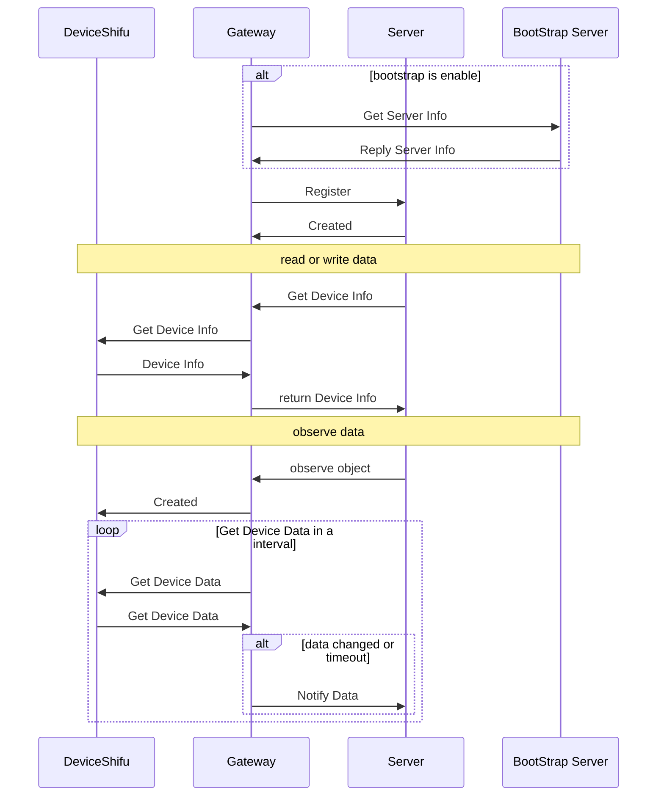

# LwM2M Gateway design

## Why need LwM2M Gateway

For telemetryService only support push data to the server, but for LwM2M protocol, it support both push and pull data from the device. it is hard to implement the pull data feature in the telemetryService.
So we need a gateway make deviceShifu to adapt the LwM2M protocol. to support pull data call from server and auto push data to the server.

## Goal

### Design Goal

- [LwM2M protocol using v1.0.x version](https://www.openmobilealliance.org/release/LightweightM2M/V1_0-20170208-A/OMA-TS-LightweightM2M-V1_0-20170208-A.pdf).
- LwM2M protocol under UDP.
- Support using LwM2M protocol to communicate with the server.
- Support both `read` and `write` requests.
- Support Notify and Observe feature.

### Non-Goal

- Support LwM2M v1.1.x or later version.
- Datagram Transport Layer Security (DTLS) support.
- Over TCP or other protocol.
- Bootstrap Server.
- Support all the LwM2M Object.
- Support all the LwM2M Resource.

## LwM2M Gateway Design

For LwM2M Gateway, it will as a LwM2M client to connect a server and it will handle all request from the server over the LwM2M protocol. 

### Centralized Or Distributed Gateway?

- Centralized: All device connect to the same gateway, and the gateway will connect to the server.
    When a device enable the gateway feature, it will register to the gateway and the gateway will call the server to update the device info. Each device will have a unique ObjectId like `/33953` and their instruction will be a instance of the ObjectId like `/33953/1`.
- Distributed: Each device connect to a gateway, and the gateway will connect to the server.
    When a device enable the gateway feature, it will create a pod to host the gateway and register to the server. Then the server will call the gateway to update the device info or get the data.

in the current design, we will use the centralized gateway.

### What will the gateway do?

1. If bootStrap is enable, the gateway will get the server info from the bootStrap server.
2. Start the LwM2M Client and get all the device info from the deviceShifu.
3. Register to the server and update the device info.
4. Listen on the LwM2M default port 5683 and handle the request from the server.
5. When server enable Observe feature, the gateway will notify the server when the data changed or timeout.
6. When server send the read or write request, the gateway will call the deviceShifu to get the data or set the data.



### Protocol Specification

```yaml
apiVersion: shifu.edgenesis.io/v1alpha1
kind: ShifuGateWay
metadata:
    name: LwM2M-gateway
    namespace: shifu-services
spec:
    address: 0.0.0.0:5683
    gatewaySettings:
        LwM2MSetting:
            BootstrapServer: "http://bootstrap-server:8080"
            EndpointName: "LwM2M-gateway"
---
apiVersion: shifu.edgenesis.io/v1alpha1
kind: ShifuGateWayConfig
metadata:
  name: LwM2M-device1
  namespace: shifu-services
spec:
  gatewayName: LwM2M-gateway
  instructions:
    - EdgeDeviceName: device1
      name: object1
      accessMode: read/write/readwrite
    - EdgeDeviceName: device1
      name: object2
      accessMode: read/write/readwrite
```

When Deploy ShifuGateWay, controller will create a deployment and service for the gateway. and when deploy ShifuGateWayConfig, controller will patch the gateway to update the device info.

Here is the example of the deployment and service:
```yaml
apiVersion: apps/v1
kind: Deployment
metadata:
 name: LwM2M-gateway
 namespace: shifu-services
spec:
    replicas: 1
    selector:
    matchLabels:
        app: LwM2M-gateway
    template:
    metadata:
        labels:
        app: LwM2M-gateway
    spec:
        containers:
        - name: LwM2M-gateway
            image: LwM2M-gateway:latest
            ports:
            - containerPort: 5683
              type: UDP
...
---
apiVersion: v1
kind: Service
metadata:
 name: LwM2M-gateway
 namespace: shifu-services
spec:
   selector:
       app: LwM2M-gateway
   ports:
       - protocol: UDP
       port: 5683
       targetPort: 5683
   type: LoadBalancer
```
