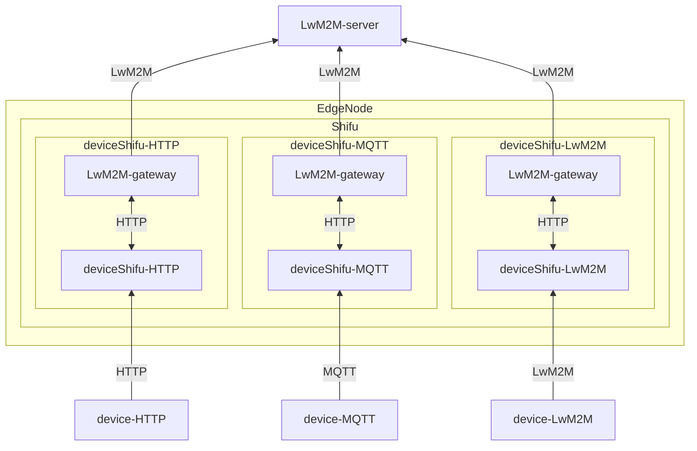
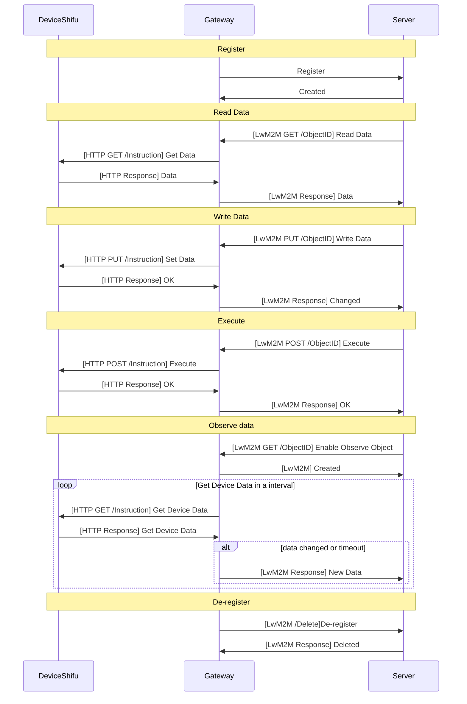

# LwM2M Gateway design

## Why need LwM2M Gateway

A telemetry service typically pushes data from devices to a data server but does not have the capability to pull data from the device or post data from the cloud to the device. LwM2M (Lightweight Machine to Machine) protocol, however, usually requires both these features. To support this, an LwM2M Gateway is necessary to enable the deviceShifu to adapt to the LwM2M protocol, handle requests from the LwM2M server, and push data to the cloud.

## Goal

### Design Goal

- Enable the device to act as an LwM2M device registered with the LwM2M server.
- Provide a method to connect deviceShifu to the LwM2M server.
- Allow the LwM2M server to read, write, and execute instructions on deviceShifu via the LwM2M protocol.

### Non-Goal

- Support for all features in the LwM2M protocol.
- Automatic recognition and generation of LwM2M Objects and Resources according to the [OMA Standard](https://github.com/OpenMobileAlliance/lwm2m-registry).

### Features

- Support for [LwM2M protocol v1.0.x](https://www.openmobilealliance.org/release/LightweightM2M/V1_0-20170208-A/OMA-TS-LightweightM2M-V1_0-20170208-A.pdf).
- LwM2M protocol over UDP.
- Datagram Transport Layer Security (DTLS) support.
- Support for LwM2M protocol communication with the server.
- Support for `Read`, `Write` and `Execute` requests.
- Support Notify and Observe feature.

### Unsupported Features

-	Support for LwM2M v1.1.x or later.
-	Support over TCP or other protocols.
-	Bootstrap server.
-	Support for all LwM2M Objects.
-	Support for all LwM2M Resources.

## LwM2M Gateway Design

The LwM2M Gateway consists of two main components: an LwM2M client that connects to the LwM2M server and an HTTP client that connects to deviceShifu.

When the server sends a read or write request to the gateway, the gateway calls the deviceShifu instructions to either retrieve or set the data. If the server enables the Observe feature, the gateway regularly collects data from the deviceShifu. If the data changes or a timeout occurs, the gateway notifies the server with the updated data.



### What Does the Gateway Do?

1.	Start the LwM2M client and obtain all device information from deviceShifu.
2.	Register the device with the server and update the device information.
3.	Handle requests from the server.
4.	If the server enables the Observe feature, notify the server when data changes or a timeout occurs.
5.	Handle read or write requests by calling deviceShifu to get or set the data.
6.	Before shutting down, deregister from the server and stop the LwM2M client.
7.	If the server disconnects, the gateway will attempt to reconnect and re-register.
8.	If a deviceShifu instruction times out, the gateway will return an error message to the server.



### Detail Design

#### Read Request

When the server sends a read request, the gateway will call the deviceShifu instruction using the `GET` method. The gateway retrieves the data from deviceShifu and returns it to the server.

#### Write Request

When the server sends a write request, the gateway will call the deviceShifu instruction using the `PUT` method with the data provided in the request body and return a changed status code to the server.

#### Execute Request

When the server sends an execute request, the gateway will call the deviceShifu instruction using the `POST` method without a request body.

#### Observe and Notify

When the server enables the Observe feature, the gateway will collect data from deviceShifu at regular intervals. If the data changes or a timeout occurs, the gateway will notify the server with the updated data.

### Gateway Configuration

To connect to the server, the gateway requires configuration details such as the server address, endpoint name, security mode, and PSK key in the EdgeDevice YAML file. The LwM2MSettings are the same as those in the deviceShifu LwM2MSettings.

```yaml
apiVersion: shifu.edgenesis.io/v1alpha1
kind: EdgeDevice
metadata:
  name: edgedevice
  namespace: devices
spec:
  sku: "LwM2M Device"
  connection: Ethernet
  address: --
  protocol: LwM2M
  protocolSettings:
    LwM2MSetting:
      ...
  gatewaySettings:
    protocol: LwM2M
    address: leshan.eclipseprojects.io:5684
    LwM2MSetting:
      endpointName: LwM2M-device
      securityMode: DTLS
      dtlsMode: PSK
      cipherSuites:
        - TLS_PSK_WITH_AES_128_CCM_8
      pskIdentity: LwM2M-hint
      pskKey: ABC123
```

To map the LwM2M Object and Resource to deviceShifu, we add a `gatewayPropertyList` field for instructions in the deviceShifu ConfigMap. This indicates that the instruction will forward to the LwM2M protocol resource. The ObjectId represents the LwM2M Object Id, and DataType represents the LwM2M Resource Type.

Supported Data Types: `int`, `float`, `string`, `bool`. By default, the data type is `string`.

```yaml
apiVersion: v1
kind: ConfigMap
metadata:
  name: configmap
  namespace: deviceShifu
data:
  instructions: |
    instructions:
      instruction1:
        gatewayPropertyList:
          ObjectId: 1/0/0
          DataType: int
```

### Test Plan

- Use [Leshan](HTTPs://github.com/eclipse-leshan/leshan) as the LwM2M server to connect an HTTP device to the server.
- Normal Mode Test: Perform read, write, and execute operations on the device via the LwM2M Gateway.
- Observe Mode Test: Enable the observe mode from the server, read and write data from the device, and validate that the gateway correctly notifies the server when data changes or a timeout occurs.