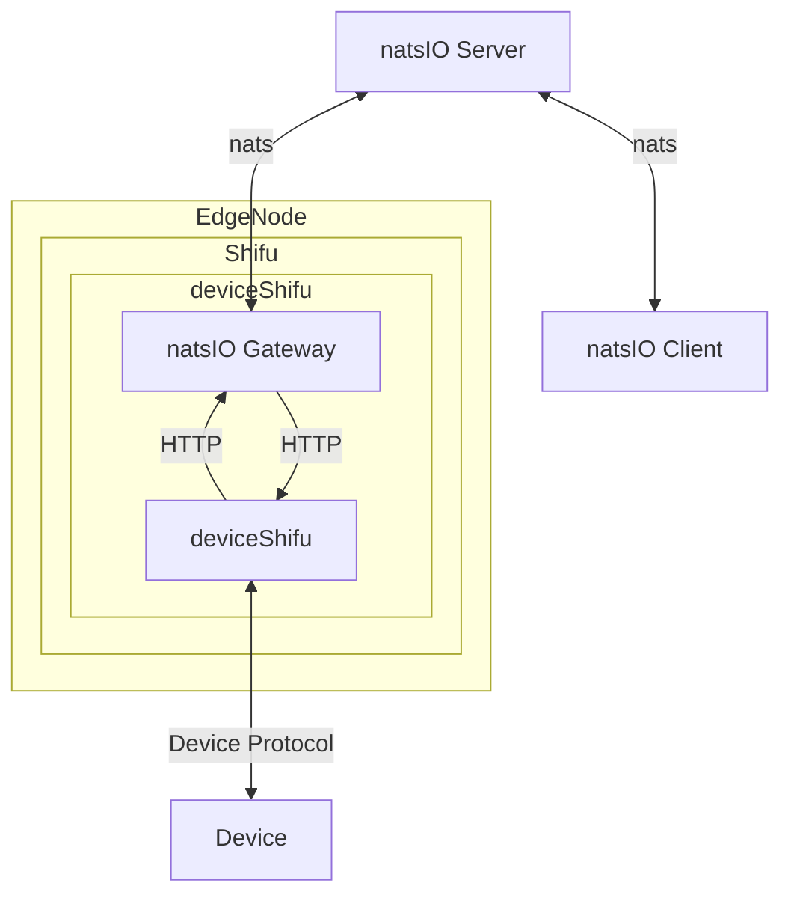

# natsIO Gateway Design

natsIO Gateway is a component that allows deviceShifu to publish data to natsIO server and subscribe to natsIO server to call deviceShifu instructions to handle it.

## Goal

### Design Goal

- Enable the device to act as an natsIO client.
- Provide a method to connect deviceShifu to the natsIO server.
- Allow deviceShifu to publish data which from device to natsIO server with interval.
- Allow deviceShifu to subscribe to natsIO server and call deviceShifu instructions to handle it.

### Non-Goal

- Support for all features in the natsIO protocol.
- Provide all authentication and authorization features.
- Integrate natsIO Server into deviceShifu.


## natsIO Gateway Design

The natsIO Gateway is a component that allows deviceShifu to publish data to natsIO server and subscribe to natsIO server to call deviceShifu instructions to handle it.



### What Does the Gateway Do?

1. Start the natsIO client and obtain all device information from deviceShifu.
2. Subscribe to natsIO server and set callback function to handle the message from target topic.
3. Create a new thread for each publisher topic to publish data to natsIO server with interval.


## Detail Design

### Instruction Config

The instruction config is a configmap that contains the instruction name and the instruction config.

```yaml
apiVersion: v1
kind: ConfigMap
metadata:
  name: configmap
  namespace: deviceShifu
data:
  instructions: |
    instructions:
      instruction1:
        gatewayPropertyList:
          Topic: "testTopic1"
          Mode: "publisher"
          PublisherIntervalMs: 1000
```

- Topic: The topic to publish data to natsIO server.
- Mode: The mode of the instruction. The mode can be "publisher" or "subscriber".
  - "publisher": The instruction is a publisher which publish data to natsIO server with interval.
  - "subscriber": The instruction is a subscriber which subscribe to natsIO server and call deviceShifu instructions to handle it.
- PublisherIntervalMs: The interval to publish data to natsIO server. If the mode is "publisher", the interval is the interval to publish data to natsIO server.


### Subscribe to natsIO

After the natsIO Gateway starts, it will automatically subscribe the instruction which is set in the deviceShifu ConfigMap. and then the natsIO Gateway will set the callback function to handle the message from target topic. After the callback function is called, the natsIO Gateway will call the deviceShifu instructions to handle it to call the deviceShifu instructions to handle it.

```yaml
apiVersion: v1
kind: ConfigMap
metadata:
  name: configmap
  namespace: deviceShifu
data:
  instructions: |
    instructions:
      instruction1:
        gatewayPropertyList:
          Topic: "testTopic1"
          Mode: "subscriber"
```


### Publish to natsIO

After the natsIO Gateway starts, it will create a new thread for each publisher topic to publish data to natsIO server with interval. By default, the interval is 1 second. The interval can be set in the deviceShifu ConfigMap.

```yaml
apiVersion: v1
kind: ConfigMap
metadata:
  name: configmap
  namespace: deviceShifu
data:
  instructions: |
    instructions:
      instruction1:
        gatewayPropertyList:
          Topic: "testTopic1"
          Mode: "publisher"
          PubGetIntervalMs: 1000
```

## Test Plan

- Publish data to natsIO server with interval.
  - Test the natsIO Gateway to publish data to natsIO server with interval.
  - Test the natsIO Gateway to publish data to natsIO server with 1000ms interval.
  - Test the natsIO Gateway to publish data to natsIO server with 100ms interval.
  - Test the natsIO Gateway to publish data to natsIO server with 10ms interval.
  - Test the natsIO Gateway to publish data to natsIO server with 1ms interval.

- Subscribe to natsIO server and call deviceShifu instructions to handle it.
  - Test the natsIO Gateway to subscribe to natsIO server and call deviceShifu instructions to handle it.
  - Test the natsIO Gateway to handle the message from natsIO server with 1000ms interval.
  - Test the natsIO Gateway to handle the message from natsIO server with 100ms interval.
  - Test the natsIO Gateway to handle the message from natsIO server with 10ms interval.
  - Test the natsIO Gateway to handle the message from natsIO server with 1ms interval.

