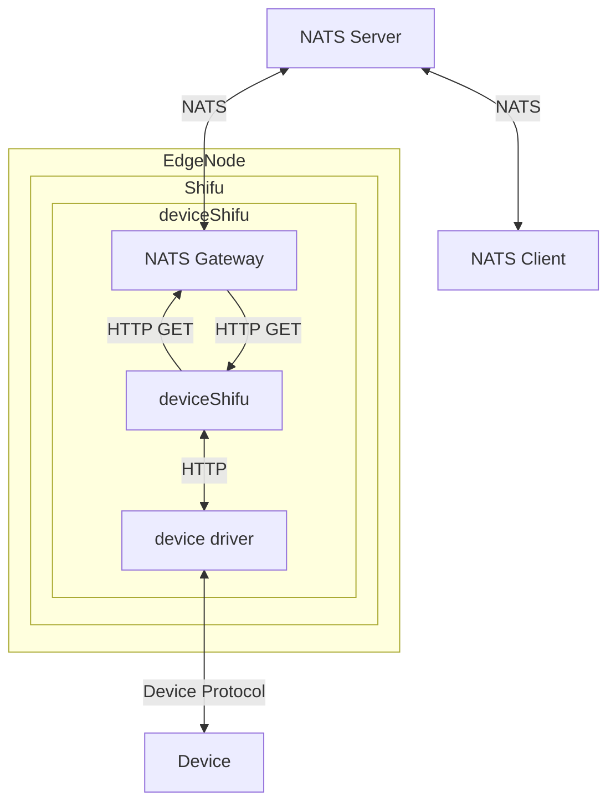
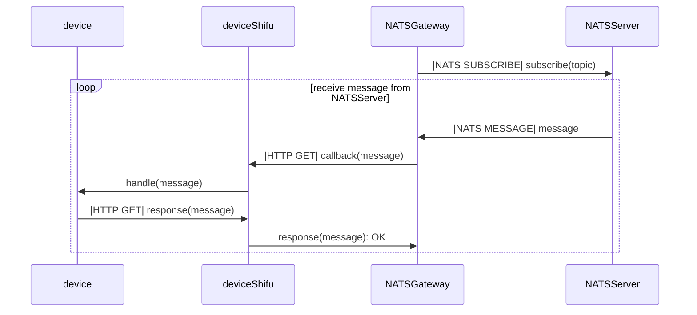
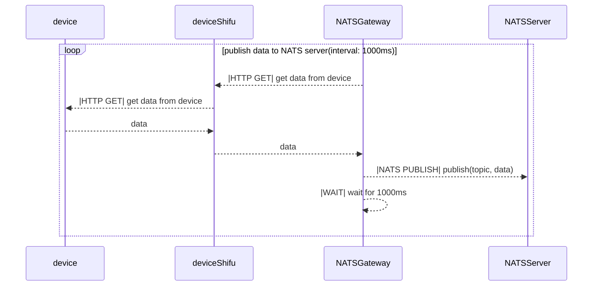

# NATS Gateway Design

NATS Gateway is a component that allows deviceShifu to publish data to NATS server and subscribe to NATS server to call deviceShifu instructions to handle it.

## Goal

### Design Goal

- Enable the device to act as an NATS client.
- Provide a method to connect deviceShifu to the NATS server.
- Allow deviceShifu to publish data which from device to NATS server with interval.
- Allow deviceShifu to subscribe to NATS server and call deviceShifu instructions to handle it.

### Non-Goal

- Support for all features in the NATS protocol.
- Provide all authentication and authorization features.
- Integrate NATS Server into deviceShifu.


## NATS Gateway Design

The NATS Gateway is a component that allows deviceShifu to publish data to NATS server and subscribe to NATS server to call deviceShifu instructions to handle it.



### What Does the Gateway Do?

1. Start the NATS client and obtain all device information from deviceShifu.
2. Subscribe to NATS server and set callback function to handle the message from target topic.
3. Create a new thread for each publisher topic to publish data to NATS server with interval.


## Detail Design

### NATS Gateway Setting

The NATS Gateway Setting is a gateway settings  that contains the NATS Gateway setting.

```yaml
apiVersion: shifu.edgenesis.io/v1alpha1
kind: EdgeDevice
...
spec:
  ...
  NATSSetting:
    reconnect: true
    maxReconnectTimes: 20
    reconnectWaitSec: 20
    timeoutSec: 2
```
- reconnect: Whether to reconnect to the NATS server default is true.
- maxReconnectTimes: The max reconnect times to the NATS server default is 60.
- reconnectWaitSec: The wait time to reconnect to the NATS server default is 2.
- timeoutSec: The timeout time to reconnect to the NATS server default is 2.


### Instruction Config

The instruction config is a configmap that contains the instruction name and the instruction config.

```yaml
apiVersion: v1
kind: ConfigMap
metadata:
  name: configmap
  namespace: deviceShifu
data:
  instructions: |
    instructions:
      instruction1:
        gatewayPropertyList:
          Topic: "testTopic1"
          Mode: "publisher"
          PublisherIntervalMs: 1000
```

- Topic: The topic to publish data to NATS server.
- Mode: The mode of the instruction. The mode can be "publisher" or "subscriber".
  - "publisher": The instruction is a publisher which publish data to NATS server with interval.
  - "subscriber": The instruction is a subscriber which subscribe to NATS server and call deviceShifu instructions to handle it.
- PublisherIntervalMs: The interval to publish data to NATS server. If the mode is "publisher", the interval is the interval to publish data to NATS server.


### Subscribe to NATS



After the NATS Gateway starts, it will automatically subscribe the instruction which is set in the deviceShifu ConfigMap. and then the NATS Gateway will set the callback function to handle the message from target topic. After the callback function is called, the NATS Gateway will call the deviceShifu instructions to handle it to call the deviceShifu instructions to handle it.

```yaml
apiVersion: v1
kind: ConfigMap
metadata:
  name: configmap
  namespace: deviceShifu
data:
  instructions: |
    instructions:
      instruction1:
        gatewayPropertyList:
          Topic: "testTopic1"
          Mode: "subscriber"
```


### Publish to NATS




After the NATS Gateway starts, it will create a new thread for each publisher topic to publish data to NATS server with interval. By default, the interval is 1 second. The interval can be set in the deviceShifu ConfigMap.

```yaml
apiVersion: v1
kind: ConfigMap
metadata:
  name: configmap
  namespace: deviceShifu
data:
  instructions: |
    instructions:
      instruction1:
        gatewayPropertyList:
          Topic: "testTopic1"
          Mode: "publisher"
          PublisherIntervalMs: 1000
```

## Test Plan

- Reconnect to NATS server when the connection is lost
  - When server is not available, the NATS Gateway will reconnect to the NATS server.
  - After server is available, the NATS Gateway will reconnect to the NATS server and all action are resumed.
  - If reach the max reconnect times, the NATS Gateway will stop reconnecting and set the status to failed.
  - If the Nat

- Publish data to NATS server with interval.
  - Test the NATS Gateway to publish data to NATS server with interval.
  - Test the NATS Gateway to publish data to NATS server with 1000ms interval.
  - Test the NATS Gateway to publish data to NATS server with 100ms interval.
  - Test the NATS Gateway to publish data to NATS server with 10ms interval.

- Subscribe to NATS server and call deviceShifu instructions to handle it.
  - Test the NATS Gateway to subscribe to NATS server and call deviceShifu instructions to handle it.
  - Test the NATS Gateway to handle the message from NATS server with 1000ms interval.
  - Test the NATS Gateway to handle the message from NATS server with 100ms interval.
  - Test the NATS Gateway to handle the message from NATS server with 10ms interval.

