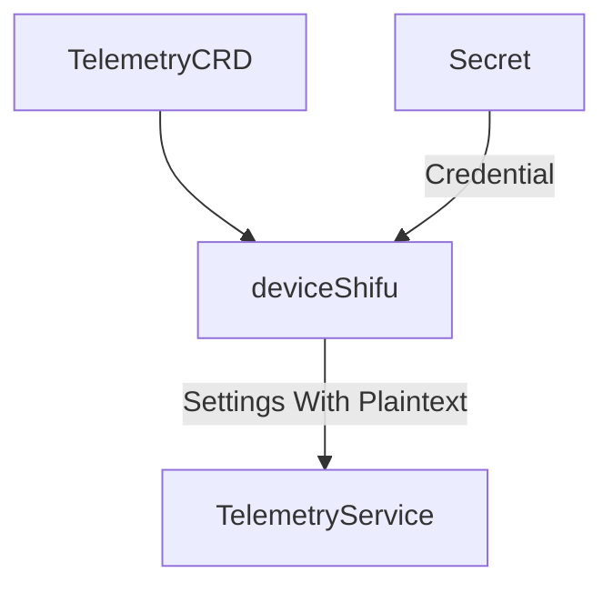

# Telemetry Secret Loading Design

## Introduction



Telemetry Service is a standalone service but the settings in `TelemetryServiceCRD` are loaded by deviceShifu and sent to Telemetry Service. If the settings contain credentials, there will exist the problem of plaintext in communication between deviceShifu and Telemetry Service.

There could be multiple ways to deal with it:

1. Add a custom encode/decode algorithm in communication between deviceShifu and Telemetry Service.
2. Let the Telemetry Service manage all `TelemetryServiceCRD` info. deviceShifu only specifies the name of `TelemetryServiceCRD`. But the Telemetry Service's workload may be too high.
3. deviceShifu still sends all info as before but hides the credential, instead, it will let the Telemetry Service find the `Secret` by the name of `TelemetryServiceCRD`.
4. deviceShifu still sends all info as before but the credential field in `TelemetryServiceCRD` doesn't present the plaintext of the credential, instead, it will be the name of `Secret` which contains the credential.

| Methods                                                      | Pros                                                   | Cons                                                         |
| ------------------------------------------------------------ | ------------------------------------------------------ | ------------------------------------------------------------ |
| encode/decode in communication                               | easy to implement                                      | `Secret` still mounts on deviceShifu side                    |
| TelemetryService manages all `TelemetryServiceCRD`           | better semantic                                        | TelemetryService's workload may be too high                  |
| deviceShifu sends the setting but hides the credential, using the name of `TelemetryServiceCRD` as the `Secret` name | only the settings with credentials need to be modified | `Secret` name need to be the `TelemetryServiceCRD` with prefix. Need to change the protocol of communication |
| use the credential field to find the `Secret`                | minimal modification                                   | The semantics of credential in `TelemetryServiceCRD` is modified |

We will use the last way here. Since the clientset contains the cache for performance optimization, so Telemetry Service will not actually ask the API server for the `Secret` every time we push data.

## General Design


1. Telemetry Service created with k8s client.
2. deviceShifu loads info from `TelemetryServiceCRD` and sends it to Telemetry Service, with the credential field to be the name of `Secret` that contains the base64-encoded credential.
3. Telemetry Service load `Secret` and write credential into the setting.
4. Grant Telemetry Service-sa with `Secret` read RBAC.

## Design Details

1. Telemetry Service
   1. Create k8s client at the beginning.
      ```go
      func init() {
        config, err := rest.InClusterConfig()
        ...
        clientSet, err = kubernetes.NewForConfig(config)
        ...
      }
      ```
   
   2. When receiving a request, load the credential from the `Secret` and write it to the setting.
      ```go
      func InjectSecret(setting *v1alpha1.SQLConnectionSetting) {
        ...
        // for SQL
        *setting.Secret, err := GetPasswordFromSecret(*setting.Secret)
        // for MQTT
        *setting.MQTTServerSecret, err := GetPasswordFromSecret(*setting.MQTTServerSecret)
        ...
      }
      ```

2. deviceShifu

   HTTP Telemetry requests will bypass Telemetry Service, so deviceShifu is still required to load credential from `Secret`.

   ```go
   // before push to HTTP endpoint
   func InjectSecret(setting *v1alpha1.HTTPSetting) {
     *setting.Password, err := GetPasswordFromSecret(*setting.Password)
   }
   ```

3. Modify the RBAC YAML files. Add `get`, `list` and `watch` to Telemetry Service-sa.