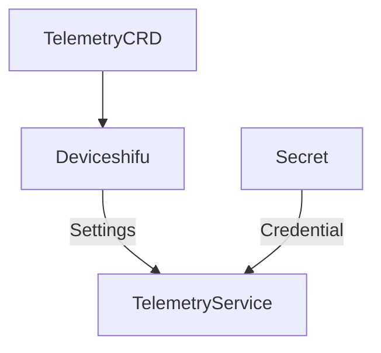

# Telemetry Secret Loading Design

## Introduction


Telemetry Service is a standalone service. But the settings in TelemetryServiceCRD is loaded by Deviceshifu and sent to Telemetry Service. If the setting contains credential, there will exist the problem of plaintext in communication between Deviceshifu and Telemetry Service.

There could be multiple ways to deal with it:

1. Add a custom encode/decode algorithm in communication between Deviceshifu and Telemetry Service.
2. Let the Telemetry Service to manage all TelemetryServiceCRD info. Deviceshifu only specifies the name of TelemetryServiceCRD. But the Telemetry Service's workload may be too high.
3. Deviceshifu still send all info as before but hide the credential, instead, it will let the Telemetry Service to find the Secret by the name of TelemetryServiceCRD.
4. Deviceshifu still send all info as before. But the credential field in TelemetryServiceCRD doesn't present the plaintext of credential, instead, it will be the name of Secret which contains the credential.

| Methods                                                      | Pros                                                  | cons                                                         |
| ------------------------------------------------------------ | ----------------------------------------------------- | ------------------------------------------------------------ |
| encode/decode in communication                               | easy to implement                                     | secret still mount on Deviceshifu side                       |
| TelemetryService manage all TelemetryServiceCRD              | better semantic                                       | TelemetryService workload may be too high                    |
| Deviceshifu send setting but hide the credential, use the name of TelemetryServiceCRD as Secret name | only the settings with credential need to be modified | Secret name need to be fixed to the TelemetryServiceCRD with prefix. Need to change the protocol of communication |
| use the credential field to find the Secret                  | minimal modification                                  |                                                              |

We will use the last way here. There may still exist some improvement space, like:

1. Every time we push data, Telemetry Service needs to acquire the Secret which contains the credential. (The clientset contains cache for performance optimization, so this is not a problem.)

## General Design



1. Telemetry Service created with k8s client.
2. Deviceshifu loads info from TelemetryServiceCRD and sends to Telemetry Service, with the credential field to be the name of Secret that contains the base64-encoded credential.
3. Telemetry Service load Secret and write credential into setting.
4. Grant Telemetry Service-sa with Secret read RBAC.

## Design Details

Currently, only SQLSetting uses credential.

1. Telemetry Service
   1. Create k8s client at begining.
      1. ```Go
         func init() {
            config, err := rest.InClusterConfig()
            ...
            clientSet, err = kubernetes.NewForConfig(config)
            ...
         }
         ```
   2. When received SQL request, load credential from the Secret and write it to setting.
      1. ```Go
         func InjectSecret(setting *v1alpha1.SQLConnectionSetting, tsName, tsNamespace string) {
            ...
            pwd, err := utils.GetcredentialFromSecret(TelemetrySecretPrefix+tsName, tsNamespace)
            *setting.Secret = pwd
            ...
         }
         ```

2. Modify the RBAC yaml files. Add `get`, `list`, `watch` to Telemetry Service-sa.