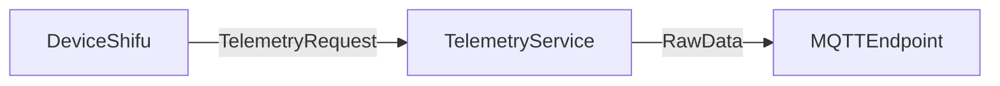

# Telemetry Service MQTT Endpoint Design

## Introduction
Telemetry Service is a standalone service that takes telemetry data collected by `deviceShifu` and fan-out it to designated endpoints for future process.
This doc aims to provide a design on how to fan-out telemetry to MQTT endpoints.

## Design-Goal
Let telemetry service support pushing telemetries to MQTT endpoints.

## Design Non-Goal
1. Let telemetry service support any random endpoints
2. let telemetry service serve as MQTT broker.

## Design Details

Telemetry will be served as an HTTP server. DeviceShifu will push the telemetries collected from physical devices to telemetry service,
and telemetry service would then fan-out the telemetries to the endpoints specified by user.

Request Struct:
```go
type TelemetryRequest struct {
	rawData     string               `json:"raw_data,omitempty"`
	mqttSetting v1alpha1.MQTTSetting `json:"mqtt_setting,omitempty"`
	httpAddress string               `json:"http_address,omitempty"`
}
```

For every push telemetry event, the telemetry service will fan-out raw-data to the user-config MQTT endpoint



TelemetryService would have 2 methods, one extract rawData and endpoint settings, the other push the rawData to the endpoint according to the settings extracted from the first one.

```go
func HandleTelemtryRequest(request *TelemetryRequest) err {
	...
	rawData, mqttSeting, err := parseTelemetryRequest()
	if err != nil {
		return err
	}
	sendToMQTTEndPoint(rawData, &mqttSettings)
	...
}

func parseTelemetryRequest(request *TelemetryRequest) ([]byte, *v1alpha1.MQTTSetting, err) {
	// Parse telemetry request
}

func sendToMQTTEndPoint(rawData []byte, mqttSettings *v1alpha1.MQTTSetting) err {
	// Fan-out rawData to mqtt broker
}
```