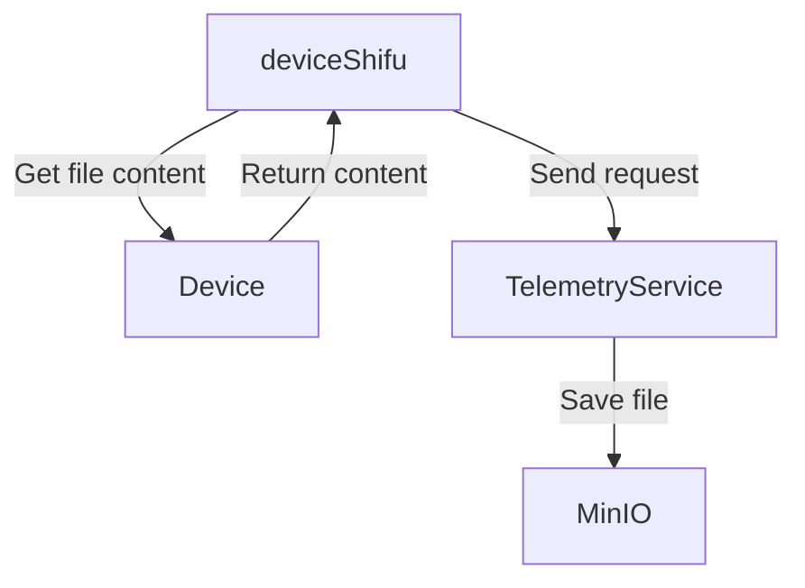

# Telemetry Service MinIO Endpoint Design

## Introduction
Telemetry Service is a standalone service that takes telemetry data collected by `deviceShifu` and fan-out it to designated endpoints for future process.

## Design-Goal
- Let telemetry service support pushing telemetries to MinIO endpoints.

## Design Non-Goal
- Let telemetry service support get/list objects.

## Design Details
Telemetry will be served as an HTTP server. deviceShifu get the file content from physical devices, then send the content to telemetry service, telemetry service will upload file to MinIO, file would name like `{device-name}/{time(RFC3339)}.{file-extension}`, file-extension and bucket will be set by MinIOSetting.

Request Struct:
```go
type TelemetryRequest struct {
    RawData        []byte            `json:"rawData,omitempty"`
    MinIOSetting   *MinIOSetting     `json:"minIOSetting,omitempty"`
}
type MinIOSetting struct {
    Secret           *string    `json:"Secret,omitempty"`
    AccessKey        *string    `json:"AccessKey,omitempty"`
    SecretKey        *string    `json:"SecretKey,omitempty"`
    RequestTimeoutMS *int64     `json:"RequestTimeoutMS,omitempty"`
    Bucket           *string    `json:"Bucket,omitempty"`
    FileExtension    *string    `json:"FileExtension,omitempty"`
    ServerAddress    *string    `json:"ServerAddress,omitempty"`
}
```

Requesting process


If you want to upload a big file(like 2~200mb), you need set a larger timeout, you can set telemetryTimeoutInMilliseconds(when deviceShifu get file from Device) at configmap.yaml, then you should set RequestTimeoutMS at telemetryservice.yaml. There is an example in `examples/minioTelemetryService/deployment/`.