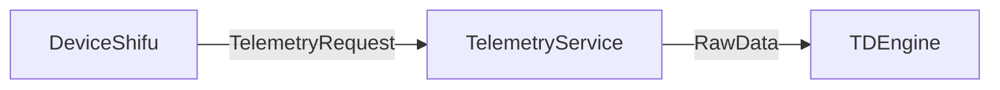

# Telemetry Service TDEngine Endpoint Design

## Introduction
Telemetry Service is a standalone service that allow `deviceshifu` send its collected telemetry to designated endpoints. This design aims to add `TDEngine` endpoint support to current Telemetry Service.

## Design-Goal
Let telemetry service support pushing telemetries to TDEngine endpoints.

## Design Non-Goal
Let telemetry service support all timeseriesDB endpoint


## Design Details
In order to add `TDEngine` as a endpoint, we need to add connection related settings telemetry service's CRD, just like  what we did for `MQTT` 

```ymal
SQLConnectionSetting:
    description: MQTTSetting defines MQTT specific settings when connecting to an EdgeDevice
    properties:
        DBServerAddress:
        type: string
        DBUserName:
        type: string
        DBSecret:
        type: string
        DBName:
        type: string
        DBTable:
        type: string
    type: object
```

We also will add the corresponding connection setting as a go struct and will add it to `TelemetryRequest`

```go
type SQLConnectionSetting struct {
	DBServerAddress *string `json:"db_server_address,omitempty"`
	DBUserName      *string `json:"db_username,omitempty"`
	DBSecret        *string `json:"db_secret,omitempty"`
	DBName          *string `json:"db_name,omitempty"`
	DBTable         *string `json:"db_table,omitempty"`
}

type TelemetryRequest struct {
	RawData              []byte                `json:"rawData,omitempty"`
	httpAddress          string                `json:"httpAddress,omitempty"`
	MQTTSetting          *MQTTSetting          `json:"mqttSetting,omitempty"`
	SQLConnectionSetting *SQLConnectionSetting `json:"sqlConnectionSetting,omitempty"`
}
```

We use the name `SQLConnection` instead of `TDEngineConnection` because we want to it to be a generic DB connection setting for scalability concerns. We want to use it to conenct to various DBs instead of TDEngine alone.

Telemetry Service will push the data to TDEngine:


After we enabled `TDEngine` endpoint ,we need to extract corresponding endpoint settings from `TelemetryRequest`.

```go
func HandleTelemtryRequest(request *TelemetryRequest) err {
	// http part
    // mqtt part
    if (request.SQLConnectionSetting != nil) {
        sqlcs := request.SQLConnectionSetting

    }
}

func sendToTDEngine(rawData []byte, sqlcs *v1alpha1.SQLConnectionSetting) err {
	// Send rawData to TDEngine
    // sample code:
    taosUri := constructTDEngineUri(sqlcs)
    taos, err := sql.Open("taosSql", taosUri)
    if err != nil {
        klog.Error("failed to connect TDengine, err:", err)
        return err
    }
    defer taos.Close()
    ...

}

func constructTDEngineUri(sqlcs *v1alpha1.SQLConnectionSetting) (string, error) {

}
```