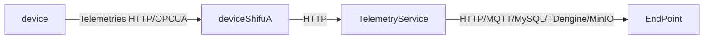

# Shifu Framework TelemetryService design

`TelemetryService` is part of the `Shifu` CRD. It describes a service endpoint which ***deviceShifu*** can push data to using the telemetry configuration, checkout the [telemetry configuration guide](https://github.com/Edgenesis/shifu/blob/main/docs/design/deviceshifu/telemetry.md)

## Design goals and non-goals

### Design goals
- `TelemetryService` should be able to read telemetry from devices and push to dedicated endpoints(e.g, HTTP, MQTT, MySQL, MinIO)

### Design non-goals

#### 100% Compatibility

A `TelemetryService` object should be able to describe most existing service endpoints such as `MySQL`, `HTTP` servers, `MQTT` endpoints, `MinIO` etc. But it should not be able to describe and compatible with 100% of the existing service endpoints.

## Architecture



`TelemetryService` would be served as a stand-alone service, which would collect telemetries from deviceShifu and distribute the telemetries to dedicated endpoints.

A `TelemetryService` object consists following configuration:

- name
- serviceType
- serviceSettings

### serviceType

`serviceType` is the type of service, can be `HTTP` for now, with more support on the way.

### serviceSettings

`serviceSettings` is settings related to the specific service.

#### Example

```yaml
--- #telemetry_service.yaml
apiVersion: shifu.edgenesis.io/v1alpha1
kind: TelemetryService
metadata:
  name: push-endpoint-1
spec:
  type: HTTP
  address: 1.2.3.4:1234/api1
  serviceSettings:
    HTTPSetting:
      username: admin
      password: password
```

## General Design
`TelemetryService` will be introduced as a stand-alone service. It will take HTTP request containing telemetries and convert it to whatever protocol the endpoint requires.
We put `TelemetryService` as a stand-alone service instead of embed it into `deviceShifu` for 2 reasons.
1. We want to keep the northbound requests, both into and out of `deviceShifu` HTTP requests.
2. We want to keep each protocol-specific `deviceShifu` type light-weight and only contains protocols necessary.

We can re-utilize the existing TelemetryServiceSpec struct defined in telemetrysevice_types to serve as the config we need to connect to the telemetry endpoints.
We can introduce a new struct `TelemetryServiceRequest` to contain a EndpointSpec and raw telemetry data. 
```go

// TelemetryServiceRequest defines the request deviceShifu send to TelemetryService
type TelemetryServiceRequest struct {
// EndpointSpec would contain connection config needed for TelemetryService to connect with the endpoint
    EndpointSpec    TelemetryServiceSpec `json:"endpoint_spec,omitempty"`
    RawData         string               `json:"raw_data,omitempty"`
}
```
When `TelemetryService` receives such request, it will use `EndpointSpec` to connect to required telemetry endpoint and send raw telemetry data over. 
How to deal with telemetry raw data would be determined by the user.

Currently, `TelemetryService` support HTTP, MySQL, TDengine, MQTT, MinIO endpoints, and we plan to support more protocols.