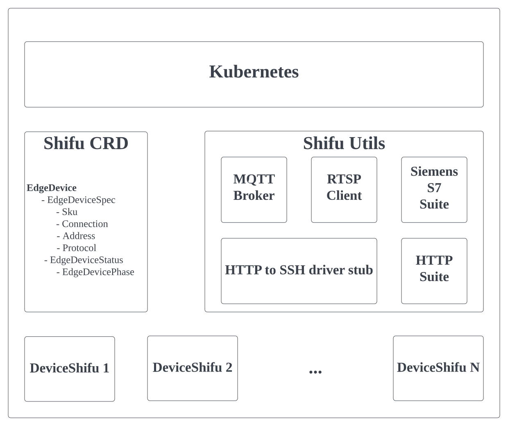

# Shifu architecture
Shifu is a Kubernetes-native and flexible platform, and every component of Shifu is running as a Pod. Here is an overview of the platform:

## EdgeDevice
Shifu defines a specific CRD for `EdgeDevice`, which describes the data of an actual device if it is connected and managed by Shifu.

Each EdgeDevice has 2 components:
`EdgeDeviceSpec` and `EdgeDeviceStatus`.

EdgeDeviceSpec specifies basic information of the device. It contains 4 fields:

	Sku        *string     # the SKU info of the device

	Connection *Connection # the connection type (e.g., ethernet, 4G, etc.)

	Address    *string     # the connection address

	Protocol   *Protocol   # the communication protocol

EdgeDevicePhase is used to describe the top-level status of the edge device:

    Pending     # The EdgeDevice is recognized but not ready for use

    Running     # The EdgeDevice is running

    Failed      # Shifu failed to bootstrap the EdgeDevice

    Unknown     # Unknown state

## DeviceShifu
EdgeDevice defines the `DeviceShifu` Pod, which is the representation, or **digital wwin** of the actual device.

Each DeviceShifu is associated with one actual device. As a digital twin, DeviceShifu is what user is communicating with:  

**Southbound** - DeviceShifu recevies user's request, converts it and sends it to the assiciated device via the way the device accepts.  
**Northbound** - DeviceShifu collects telemetries from the associated device, converts it and sends it to the frontend and to the user end.

## Shifu Utils
To support different protocols and drivers, Shifu is constantly adding new utility services to the platform. Currently, it has the following utility services:

### MQTT Broker
The MQTT Broker service serves as the middleware to process the MQTT subscription and publishing.

### RTSP Client
The RTSP client is used to continuously receive RTSP stream and decode it.

### Siemens S7 Suite
The Siemens S7 Suite allows user to edit any bits in any memory area of an S7 PLC.

### HTTP to SSH driver stub
This is a utility service that allows user to arbitrarily add any new driver with commandline executables to Shifu platform. See the page [Add New Commandline Driver](./add_new_commandline_driver.md)