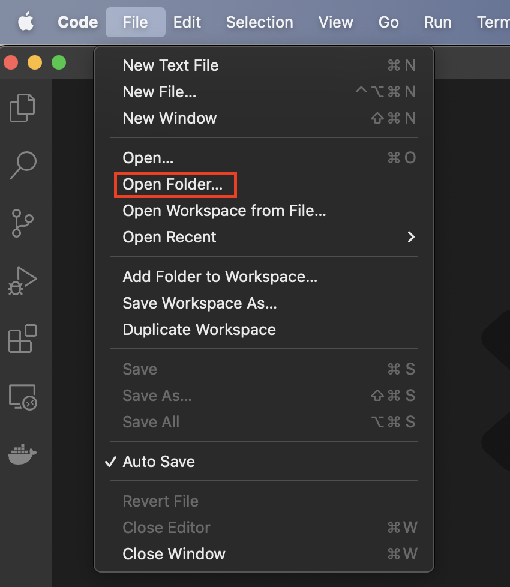
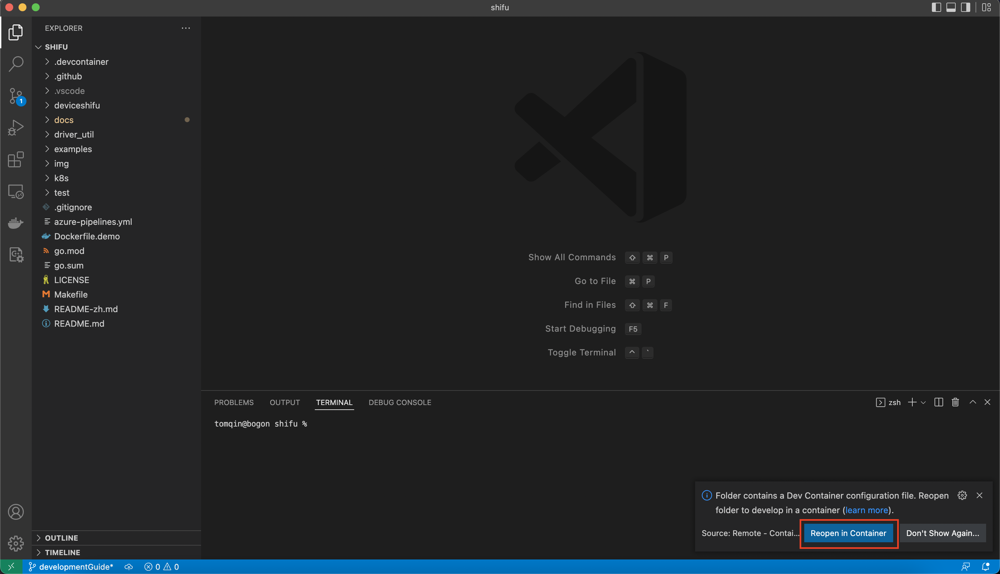

# 配置指南:

开发者你好！ 本份指南会帮助你在本地搭建适用于 `Mac OS` 的 `Shifu` 开发环境。

### 本指南已在以下平台中测试过:
```
MacBook Pro (14-inch, 2021)
```

如您在使用本指南中有任何的问题以及发现了任何错误请毫不犹豫的在GitHub中建立一个 [issue](https://github.com/Edgenesis/shifu/issues/new) 。

# 步骤:
## 1. 搭建环境

### 1.1 安装 `homebrew`

从 [brew.sh](https://brew.sh/), 用以下命令安装 ```homebrew```: 
```
/bin/bash -c "$(curl -fsSL https://raw.githubusercontent.com/Homebrew/install/HEAD/install.sh)"
```

***(可选)*** 如果需要在命令行使用代理的话请用:
```
export http_proxy='http://[proxyServerAddr]:[port]'
export https_proxy='http://[proxyServerAddr]:[port]'
export ALL_PROXY='http://[proxyServerAddr]:[port]'
```

### 1.2 在本地克隆 ***Shifu*** 项目:
使用以下命令克隆 ***Shifu***:
```sh
git clone https://github.com/Edgenesis/shifu.git
```

### 1.3 安装 `Docker`:
从 Docker 官方的 [安装指南](https://docs.docker.com/desktop/mac/install/) 中安装 Docker。

### 1.4 安装 `Visual Studio Code` (可选, 但是*强烈推荐*)

[下载](https://code.visualstudio.com/download) dmg 并安装。

按章完成后，使用 "File --> Open Folder" 来打开 ***Shifu*** 目录:



屏幕右下角会自动有一个弹窗来从 remote container 中打开项目:



点击之后，VSCode会将项目挂载到容器中并打开。开发环境至此搭建完毕！


***提示***: 如果您使用 `Visual Studio Code` 的 `Dev Container`, 您可以跳过下面所有的环境部署步骤。

### 1.5 下载并安装 `Go`
根据您的 Mac 的 CPU 架构，请在下面两个中选择一个安装包下载:

运行 英特尔(amd64) 的 Mac:
```
https://go.dev/dl/go1.17.10.darwin-amd64.pkg
```
运行 M1(arm64) 的 Mac:
```
https://go.dev/dl/go1.17.10.darwin-arm64.pkg
```

### 1.6 安装 `kind`
从 [kind](https://kind.sigs.k8s.io/docs/user/quick-start/) 官网, 通过下面的命令安装:
```sh
brew install kind
```

### 1.7 安装 `kubectl`
从 [kubernetes](https://kubernetes.io/docs/tasks/tools/install-kubectl-macos/) 官网, 通过下面的命令安装:
```sh
brew install kubectl
```

### 1.8 安装 `kubebuilder`
从 [kubebuilder](https://book.kubebuilder.io/quick-start.html) 官网, 通过下面的命令安装:
```sh
curl -L -o kubebuilder https://go.kubebuilder.io/dl/latest/$(go env GOOS)/$(go env GOARCH)
chmod +x kubebuilder && mv kubebuilder /usr/local/bin/

```

### 1.9 安装 `Go` 依赖
切换到 `shifu` 的目录, 执行:
```sh
GO111MODULE=on go mod download
```
***(可选)*** 如果您在下载依赖过程中遇到问题, 通过下面命令来添加一个代理:
```sh
GOPROXY=https://goproxy.cn,direct GO111MODULE=on go mod download
```

# 接下来?
跟着我们的 [创建指南](build-shifu-zh.md) 来搭建 `Shifu` 。
