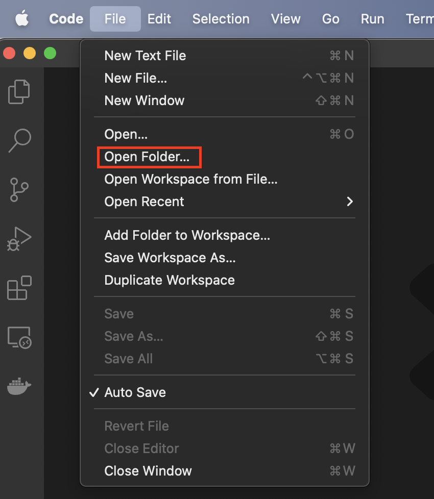

# Intruduction:

Welcome developers! This guide will help you on setting up development environment for Shifu on `Mac OS`

### This guide has been tested on the following platform:
```
MacBook Pro (14-inch, 2021)
```

# Steps:
## 1. Setting up the environment

### 1.1 Install `homebrew`

From [brew.sh](https://brew.sh/), install ```homebrew``` with the following command: 
```
/bin/bash -c "$(curl -fsSL https://raw.githubusercontent.com/Homebrew/install/HEAD/install.sh)"
```

### (Optional) If you need to proxy connections from your terminal:
```
export http_proxy='http://[proxyServerAddr]:[port]'
export https_proxy='http://[proxyServerAddr]:[port]'
export ALL_PROXY='http://[proxyServerAddr]:[port]'
```

### 1.2 Clone ***Shifu*** repository:
Use the following command to clone ***Shifu***:
```sh
git clone https://github.com/Edgenesis/shifu.git
```

### 1.3 Install `Docker`:
Follow the official [installation guide](https://docs.docker.com/desktop/mac/install/) from Docker official website.

### 1.4 Install `Visual Studio Code` (Optional, but *highly recommended*)
***Note***: If you use `Visual Studio Code` you can skip all below steps

[Download](https://code.visualstudio.com/download) the installation dmg and install.

After installation, use "File --> Open Folder" to open ***Shifu*** directory:


A prompt should show up automatically to open this project in remote container:


Click on that, VSCode should open your project in remote container. Your development environment is ready!

### 1.5 Download and install `Go` (Skip this step if you are using `Visual Studio Code`)
Depending on your Mac's CPU architecture, you can download one of the following packagaes:

For Intel(amd64) Macs:
```
https://go.dev/dl/go1.17.10.darwin-amd64.pkg
```
For M1(arm64) Macs:
```
https://go.dev/dl/go1.17.10.darwin-arm64.pkg
```

### 1.6 Install `kind` (Skip this step if you are using `Visual Studio Code`)
from [kind](https://kind.sigs.k8s.io/docs/user/quick-start/), install with:
```sh
brew install kind
```

### 1.7 Install `kubectl` (Skip this step if you are using `Visual Studio Code`)
from [kubernetes](https://kubernetes.io/docs/tasks/tools/install-kubectl-macos/), install with:
```sh
brew install kubectl
```

### 1.8 Install `kubebuilder` (Skip this step if you are using `Visual Studio Code`)
from [kubernetes](https://kubernetes.io/docs/tasks/tools/install-kubectl-macos/), install with:
```sh
curl -L -o kubebuilder https://go.kubebuilder.io/dl/latest/$(go env GOOS)/$(go env GOARCH)
chmod +x kubebuilder && mv kubebuilder /usr/local/bin/

```

### 1.9 Install `Go` dependencies (Skip this step if you are using `Visual Studio Code`)
Navigate to `shifu`'s directory, issue:
```sh
GO111MODULE=on go mod download
```
***(Optional)*** If you are having issue download dependencies, add a proxy by using:
```sh
GOPROXY=https://goproxy.cn,direct GO111MODULE=on go mod download
```
