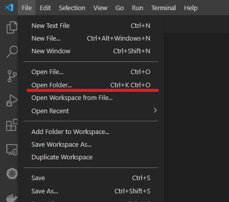
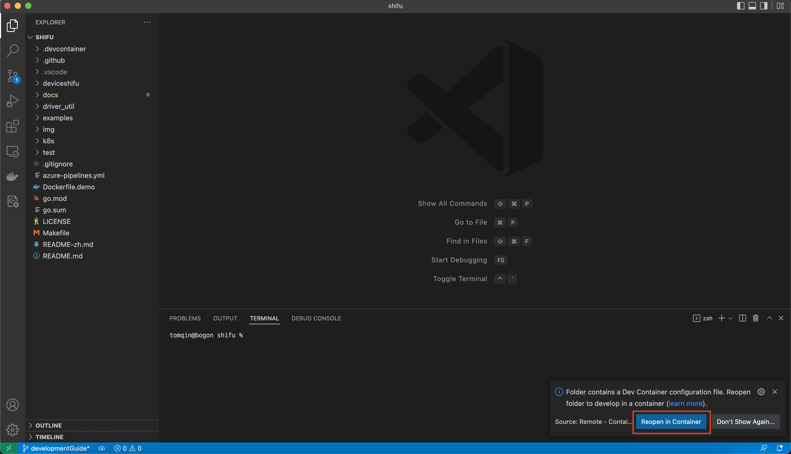

# 配置指南:

欢迎! 开发者， 本份指南会帮助你在本地搭建适用于 `Windows` 的 `Shifu` 开发环境。

### 本指南已在以下平台中测试过:
```
Windows 11 Pro
```

如您在使用本指南中有任何的问题以及发现了任何错误请毫不犹豫的在GitHub中建立一个 [issue](https://github.com/Edgenesis/shifu/issues/new) 。

# 步骤:
## 1. 搭建环境

### 1.1 安装 `wsl`

从 [微软](https://docs.microsoft.com/en-us/windows/wsl/install) 官网, 通过管理员 PowerShell 执行以下命令来安装 `wsl`: 
```PowerShell
wsl --install
```

### 1.2 配置 `Ubuntu`:
从开始菜单, 输入`Ubuntu` 并点击 `Ubuntu` 软件:

根据指示来建立一个管理员账号密码。

### 1.3 在本地克隆 ***Shifu*** 项目:
使用以下命令克隆 ***Shifu***:
```bash
git clone https://github.com/Edgenesis/shifu.git
```

### 1.4 安装 `Docker`:
从 Docker 官方的 [安装指南](https://docs.docker.com/desktop/windows/install/) 中安装 Docker。

### 1.5 安装 `Visual Studio Code` (可选, 但是*强烈推荐*)

[下载](https://code.visualstudio.com/download) exe 并安装。

安装完毕后运行, 使用 `F1` 键来打开一个新的 WSL 窗口:


之后，用 "File --> Open Folder" 来打开 ***Shifu*** 的目录:



屏幕右下角会自动有一个弹窗来从 remote container 中打开项目:



点击之后，VSCode会将项目挂载到容器中并打开。开发环境至此搭建完毕！

***提示***: 如果您使用 `Visual Studio Code` 的 `Dev Container`, 您可以跳过下面所有的环境部署步骤。

### 1.6 安装 `Go`
从 [Go](https://go.dev/doc/install) 官网, 利用下面的命令下载并安装:
```bash
$ wget https://go.dev/dl/go1.17.10.linux-amd64.tar.gz
$ rm -rf /usr/local/go && tar -C /usr/local -xzf go1.17.10.linux-amd64.tar.gz
$ echo "export PATH=$PATH:/usr/local/go/bin" >> $HOME/.profile
```

### 1.7 安装 `kind`
从 [kind](https://kind.sigs.k8s.io/docs/user/quick-start/) 官网, 用以下命令安装:
```sh
curl -Lo ./kind https://kind.sigs.k8s.io/dl/v0.12.0/kind-linux-amd64 \
&& chmod +x ./kind \
&& mv ./kind /usr/local/bin/kind
```

### 1.8 安装 `kubectl`
从 [kubernetes](https://kubernetes.io/docs/tasks/tools/install-kubectl-linux/) 官网, 用以下命令安装:
```bash
$ curl -LO "https://dl.k8s.io/release/$(curl -L -s https://dl.k8s.io/release/stable.txt)/bin/linux/amd64/kubectl"
$ sudo install -o root -g root -m 0755 kubectl /usr/local/bin/kubectl

```

### 1.9 Install `kubebuilder`
从 [kubebuilder](https://book.kubebuilder.io/quick-start.html) 官网, 用以下命令安装:
```sh
curl -L -o kubebuilder https://go.kubebuilder.io/dl/latest/$(go env GOOS)/$(go env GOARCH)
chmod +x kubebuilder && mv kubebuilder /usr/local/bin/

```

### 1.10 安装 `Go` 依赖
切换到 `shifu` 的目录, 执行:
```sh
GO111MODULE=on go mod download
```
***(可选)*** 如果您在下载依赖过程中遇到问题, 通过下面命令来添加一个代理:
```sh
GOPROXY=https://goproxy.cn,direct GO111MODULE=on go mod download
```

# 接下来?
跟着我们的 [创建指南](build-shifu-zh.md) 来搭建 `Shifu` 。
