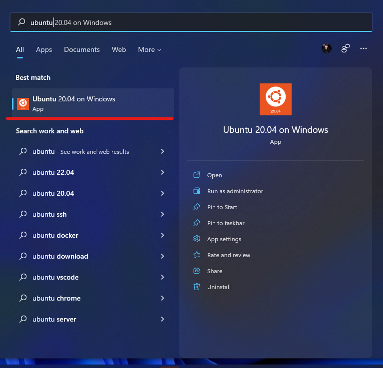
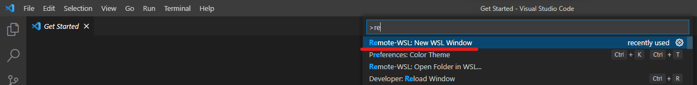

# Setup Guide:

Welcome developers! This guide will help you on setting up development environment for `Shifu` on `Windows`

### This guide has been tested on the following platform:
```
Windows 11 Pro
```

Please submit an [issue](https://github.com/Edgenesis/shifu/issues/new) to GitHub if you are having issue following this guide/you have noticed anything wrong with this guide.

# Steps:
## 1. Setting up the environment

### 1.1 Install `wsl`

From [Microsoft](https://docs.microsoft.com/en-us/windows/wsl/install), install `wsl` with the following command in `administrator` PowerShell: 
```PowerShell
wsl --install
```

### 1.2 Setup `Ubuntu`:
In Start Menu, enter `Ubuntu` and click on the `Ubuntu` app:

After that follow the prompt to setup a user with password.

### 1.3 Clone ***Shifu*** repository:
Use the following command to clone ***Shifu***:
```bash
git clone https://github.com/Edgenesis/shifu.git
```

### 1.4 Install `Docker`:
Follow the official [installation guide](https://docs.docker.com/desktop/windows/install/) from Docker official website.

### 1.5 Install `Visual Studio Code` (Optional, but *highly recommended*)

[Download](https://code.visualstudio.com/download) the installation exe and install.

After installation, use `F1` key to open a new WSL window:



Then, use "File --> Open Folder" to open ***Shifu*** directory:


A prompt should show up automatically to open this project in remote container:


Click on that, VSCode should open your project in remote container. Your development environment is ready!

***Note***: If you use `Visual Studio Code` with `Dev Container` you can skip all below environment setup steps.

### 1.6 Install `Go`
From [Go](https://go.dev/doc/install), download and install go using the following command:
```bash
$ wget https://go.dev/dl/go1.17.10.linux-amd64.tar.gz
$ rm -rf /usr/local/go && tar -C /usr/local -xzf go1.17.10.linux-amd64.tar.gz
$ echo "export PATH=$PATH:/usr/local/go/bin" >> $HOME/.profile
```

### 1.7 Install `kind`
from [kind](https://kind.sigs.k8s.io/docs/user/quick-start/), install with:
```sh
curl -Lo ./kind https://kind.sigs.k8s.io/dl/v0.12.0/kind-linux-amd64 \
&& chmod +x ./kind \
&& mv ./kind /usr/local/bin/kind
```

### 1.8 Install `kubectl`
from [kubernetes](https://kubernetes.io/docs/tasks/tools/install-kubectl-linux/), install with:
```bash
$ curl -LO "https://dl.k8s.io/release/$(curl -L -s https://dl.k8s.io/release/stable.txt)/bin/linux/amd64/kubectl"
$ sudo install -o root -g root -m 0755 kubectl /usr/local/bin/kubectl

```

### 1.9 Install `kubebuilder`
from [kubebuilder](https://book.kubebuilder.io/quick-start.html), install with:
```sh
curl -L -o kubebuilder https://go.kubebuilder.io/dl/latest/$(go env GOOS)/$(go env GOARCH)
chmod +x kubebuilder && mv kubebuilder /usr/local/bin/

```

### 1.10 Install `Go` dependencies
Navigate to `shifu`'s directory, issue:
```sh
GO111MODULE=on go mod download
```
***(Optional)*** If you are having issue download dependencies, add a proxy by using:
```sh
GOPROXY=https://goproxy.cn,direct GO111MODULE=on go mod download
```

# What's next?
Follow our [build guide](build-shifu.md) and start building `Shifu`.
