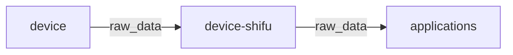
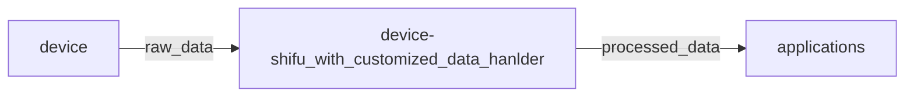

# Customized deviceShifu data handler

Shifu allows user to customize the `deviceShifu` to make the digital twin more efficient.

### Default scenario
By default, data coming from device to `deviceShifu` will be available in its original format:



### With customized processing
After adding customized logic, `deviceShifu` can process the data to make them more app-friendly:
1. convert the data into the format needed by user;
2. filter out unneeded data;
3. some calculation and data analysis on-the-fly


## Add customized deviceShifu
Here are 3 steps before we start running Shifu:
1. Write the data processing logic in `customized_handlers.py`, a general structure of the processing method is like this:
      ```python
        # use instruction/API name as the method name
        def humidity(raw_data): 
            new_data = process(raw_data)
            return new_data
    ```

2. Move `customized_handlers.py` into `pkg/deviceshifu/pythoncustomizedhandlers`
3. Build deviceShifu

## Example: humidity detector
The example device used here is in the directory `examples/deviceshifu/customized/humidity_detector`.

This device is a virtual humidity detector which will provide the humidity and temperature data in JSON format using HTTP, the 
instruction/API is just `humidity`.

#### 0. Build the humidity-detector virtual device
First step is to build the docker image of `humidity-detector` with `humidity-detector.go` and its Dockerfile in
`examples/deviceshifu/customized/humidity_detector`.

#### 1. Add the customized data handler
In `examples/deviceshifu/customized/humidity_detector/pythoncustomizedhandlers`, there is a `customized_hanlders.py`, 
copy that file into `pkg/deviceshifu/pythoncustomizedhandlers`.

#### 2. Edit Dockerfile of deviceShifu
Copy `examples/deviceshifu/customized/humidity_detector/sample_deviceshifu_dockerfiles/Dockerfile.deviceshifuHTTP`
to `dockerfiles`.

#### 3. Build deviceShifu docker image
A new deviceShifu image needs to be built to include the customized data handler.\
In the root directory of `shifu`, run the following command to build the deviceShifu docker image:
```
make buildx-build-image-deviceshifu-http-http
```

#### 4. Start Shifu
This will be exactly the same as in [quick start demo](quick-start-demo.md).\
After Shifu is running, we need to import the newly built humidity detector virtual device into the kind cluster, like this:
```
kind load docker-image humidity-detector:v0.0.1
```

#### 5. Check processed data
The raw data from this virtual device should be processed by the customized handler defined in `customized_hanlders.py`.\
In the nginx shell we will be able to curl the API `humidity` and check if the result is processed. An example result should belike this:
```
[
  {
  "unit": "℃", 
  "code": "20990922009", 
  "exception": "temperature is too high", 
  "name": "atmosphere temperature", 
  "val": "37"
  }, 
  {
    "unit": "%RH", 
    "code": "20990922009", 
    "exception": "humidity is too high", 
    "name": "atmosphere humidity", 
    "val": "88"
  }
]

```


